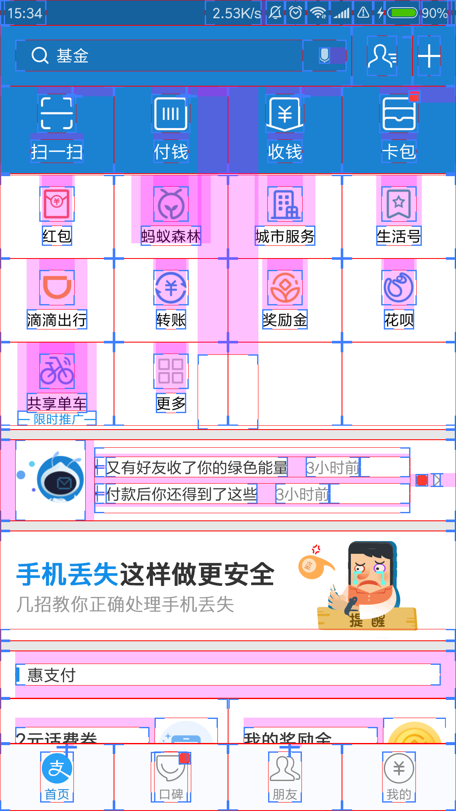
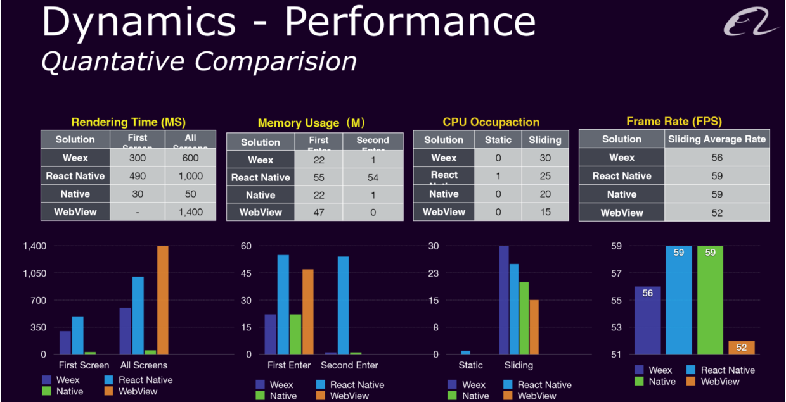

## APP开发模式

- ### 1.常用的几种开发模式

     - Native App:原生app
     - Web App: 直接通过浏览器访问的app
     - Hybrid App:混合app即原生和Html混合开发
     - React Native App:facebook开源的一套app开发方案
     - Weex App:阿里巴巴开源，类似rn的开发方案

     **Note:**  
         **RN 发布于 2015 年 10 月份**  
         **Weex 发布于 2016 年 4 月份**

- ### 2.Native App

    传统的原生APP开发模式,Android基于Java或者kotlin语言,底层调用Google的 API;iOS基于OC或者Swift语言,底层调用Apple官方提供的API。一般运行在机器操作系统上，有很强的交互,浏览使用方便，体验度高。   

    优点:   
    1.直接依托于操作系统,交互性最强,性能最好   
    2.功能最为强大,特别是在与系统交互中,几乎所有功能都能实现   

    缺点：   
    1.开发成本高，android和ios开发语言不一样   
    2.跨平台性不好   
    3.维护成本高   

    如何区分是否是原生界面还是H5界面:   
    Android:开发者选项>显示布局边界  

    |原生             |H5     
    |:------:     |:------:               
    |        |       

- ### 3.Web App  

    以HTML5+JS+CSS3，代码运行在浏览器中，通过浏览器来调用Device API,说白了就是一个触屏的网站。

    优点:  
    1.平台兼容性好    
    2.开发成本较低  
    3.维护成本低  

    缺点：  
    1.用户体验较差  
    2.性能不好  
    3.功能受限  
    4.用户留存率低  

- ### 4.Hybrid App

    部分代码以Web技术编程，部分代码由原生承担即混合开发有跨平台效果，实质是独立的原生app，这种“Native搭台，HTML 5唱戏”的开发模式，由于开发成本低廉，是目前的主流开发模式。  

    优点：  
    1.开发成本较低,可以跨平台,调试方便   
    2.维护成本低，实质只需要维护web代码   
    3.更新较为自由   
    4.部分性能要求较高的页面可用原生实现   

    缺点：   
    1.性能无法和原生相比，硬伤。   
    2.不适用与体验性较强的app。体验比原生差   

- ### 5.React Native App和Weex App

    React Native App  
	由Facebook开源的一套app开发方案。主要与Apple和Google抗衡,为开发者带去一套跨平台、动态更新的 Javascript 框架，口号是：Learn once, write anywhere，通过核心引擎将代码编译成原生组件。达到原生APP的体验效果，此方案不同于H5,也不同于原生,更像是用JS写出原生应用。**需要注意的是APP运行的是不js代码，而是利用 JSCore 转化成 Native,实质运行的还是原生组件**，所以性能才能与原生相比     
    优点:  
    1.开发成本小于原生，但是总体大于Hybrid 模式  
    2.性能体验堪比原生  
    3.跨平台开发  

    缺点：  
    1.学习曲线陡，学习成本高。  
    2.具体原生组件根据平台不同代码还是有差异  
    3.不成熟，目前仍然有坑。  
    4.根据目前市场上没有多少完全的RN app可以得知RN目前仍有不少限制，虽然是js到原生的映射，但是不见得所有组件所有api都支持。  

    Weex App  
    由阿里巴巴开源的一套app开发方案，底层原理与rn一致。  
    优点：  
    1.只要遵循特定的语法规则，完全可以达到一套代码多个平台运行  
    2.语法接近H5，基本用法和H5一致  

    缺点：  
    目前普及水平不够，仍然有坑，仍有kpi嫌疑。  

    

- ### 6.开发模式对比总结

    - 1.偏交互性的Native , 偏浏览的Web
    - 2.已经稳定的Natvie , 调试中的Web
    - 3.访问硬件的Natvie , 信息展示Web
    - 4.核心功能的Natvie , 周边辅助Web
    - 5.变化少的Native , 变化多的Web

