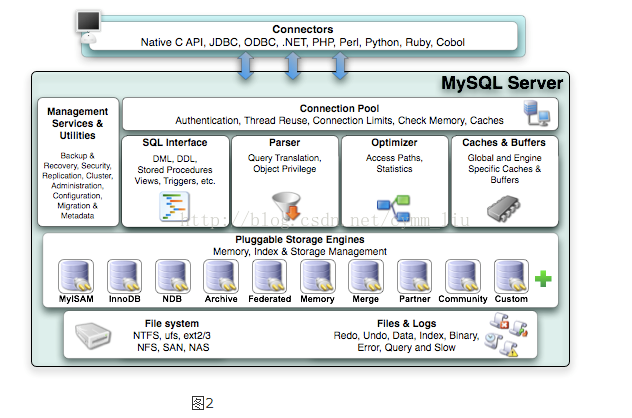

## <center>MySQL</center>

### MySQL架构优势  
MySQL的架构优势主要体现在存储引擎上，***插件式的存储引擎架构将查询处理和其他系统任务以及数据的存储提取相分离***。这种架构可以根据对应的业务和实际需求选择合适的存储引擎。   
    

1. 连接层    
    Connectors:不同语言的交互   
2. 服务层  
    Management Serveices & Utilities:系统管理和控制工具   
    Connection Pool:负责监听对 MySQL Server 的各种请求，接收连接请求，转发所有连接请求到线程管理模块   
    SQL Interface:接受用户的SQL命令，并且返回用户需要查询的结果    
    Parser:将SQL语句进行语法和语义的解析   
    Optimizer:执行查询SQL语句前对SQL语句进行优化    
    Cache和Buffer:将查询结果进行缓存，提高查询效率   
3. 引擎层  
    服务器通过API与引擎交互,而引擎负责数据的存储和提取。
4. 存储层   
    与存储引擎交互，将数据存储在文件系统上。一般数据库文件位于MySQL安装目录下的data文件夹  

### MySQL常用命令   

连接数据库: 
```shell
➜  ~ mysql -h 127.0.0.1 -u root -p
```

修改用户密码:
```sehll
➜  ~ mysqladmin -uroot -p password
```

查看所有数据库
```shell
mysql>show databases;
+--------------------+
| Database           |
|--------------------|
| information_schema |
| mysql              |
| performance_schema |
| sys                |
| test               |
+--------------------+
5 rows in set (0.00 sec)
```

选择数据库
```shell
mysql> use mysql;
Database changed
```

开启远程访问:
```shell
//如果是新用户
mysql>create user 'username'@'host' identified by 'password';

mysql>grant all on databasename.tablename TO 'username'@'host';

mysql>use mysql;

mysql>select host,user from user;

//如果是已存在用户
mysql>use mysql;

mysql>update user set host = '%' where user = 'username';

mysql>flush privileges;
```

创建和删除数据库
```shell
mysql> create database test;
Query OK, 1 row affected (0.10 sec)

mysql> drop database test;
Query OK, 0 rows affected (0.03 sec)
```

显示所有存储引擎
```shell
mysql> show engines;
+--------------------+---------+----------------------------------------------------------------+--------------+------+------------+
| Engine             | Support | Comment                                                        | Transactions | XA   | Savepoints |
+--------------------+---------+----------------------------------------------------------------+--------------+------+------------+
| ARCHIVE            | YES     | Archive storage engine                                         | NO           | NO   | NO         |
| BLACKHOLE          | YES     | /dev/null storage engine (anything you write to it disappears) | NO           | NO   | NO         |
| MRG_MYISAM         | YES     | Collection of identical MyISAM tables                          | NO           | NO   | NO         |
| FEDERATED          | NO      | Federated MySQL storage engine                                 | NULL         | NULL | NULL       |
| MyISAM             | YES     | MyISAM storage engine                                          | NO           | NO   | NO         |
| PERFORMANCE_SCHEMA | YES     | Performance Schema                                             | NO           | NO   | NO         |
| InnoDB             | DEFAULT | Supports transactions, row-level locking, and foreign keys     | YES          | YES  | YES        |
| MEMORY             | YES     | Hash based, stored in memory, useful for temporary tables      | NO           | NO   | NO         |
| CSV                | YES     | CSV storage engine                                             | NO           | NO   | NO         |
+--------------------+---------+----------------------------------------------------------------+--------------+------+------------+
9 rows in set (0.00 sec)
```
显示所用的存储引擎
```shell
mysql> show variables like '%storage_engine%';
+----------------------------------+-----------+
| Variable_name                    | Value     |
+----------------------------------+-----------+
| default_storage_engine           | InnoDB    |
| default_tmp_storage_engine       | InnoDB    |
| disabled_storage_engines         |           |
| internal_tmp_disk_storage_engine | InnoDB    |
| internal_tmp_mem_storage_engine  | TempTable |
+----------------------------------+-----------+
5 rows in set (0.01 sec)
```

### 数据库存储引擎

[数据库存储引擎](https://github.com/jaywcjlove/mysql-tutorial/blob/master/chapter3/3.5.md)

### 数据库基本操作  

创建数据库
```shell
//创建名为sql_operation的数据库，并设置字符集为utf8
mysql> create database sql_operation character set utf8;
Query OK, 1 row affected, 1 warning (0.09 sec)

mysql> use sql_operation;
Database changed

mysql> show tables;
Empty set (0.00 sec)
```

创建表
```shell
mysql> drop table if exists user_info;
Query OK, 0 rows affected, 1 warning (0.01 sec)

mysql> create table user_info(
    id int(100) unsigned not null auto_increment primary key,
    name varchar(50) not null default '' comment '用户名',
    age int(4) not null default 0 comment '年龄',
    mobile varchar(20) not null default '' comment '手机号码',
    dept_id int(100) default 100 comment '部门编号',
    unique index idx_mobile(mobile),
    index idx_deptId(dept_id)
)engine=InnoDB default charset=utf8 comment ='用户信息表';
Query OK, 0 rows affected, 1 warning (0.08 sec)

mysql> drop table if exists dept_info;
Query OK, 0 rows affected, 1 warning (0.01 sec)

mysql> create table dept_info(
    id int(100) unsigned not null auto_increment primary key,
    dept_name varchar(50) not null default '' comment '部门名称',
    dept_desc varchar(100) default '' comment '部门描述',
    index index_deptName(dept_name)
)engine=InnoDB default charset=utf8 comment='部门信息表';
Query OK, 0 rows affected, 1 warning (0.08 sec)
```

增
```shell
insert into user_info(name,age,mobile,dept_id) values ('赵三',20,'13000000001',101);
insert into user_info(name,age,mobile,dept_id) values ('钱四',22,'13000000002',102);
insert into user_info(name,age,mobile,dept_id) values ('孙五',21,'13000000003',103);
insert into user_info(name,age,mobile,dept_id) values ('李六',23,'13000000004',104);
insert into user_info(name,age,mobile,dept_id) values ('周七',25,'13000000005',102);
insert into user_info(name,age,mobile,dept_id) values ('吴八',21,'13000000006',103);
insert into user_info(name,age,mobile,dept_id) values ('郑九',25,'13000000007',102);
insert into user_info(name,age,mobile,dept_id) values ('王十',24,'13000000008',100);
insert into user_info(name,mobile) values ('冯十一','13000000009');
insert into dept_info(id,dept_name,dept_desc) values (101,'行政部','负责服务、协调总经理办公室工作');
insert into dept_info(id,dept_name,dept_desc) values (102,'市场部','市场调研与市场预测');
insert into dept_info(id,dept_name,dept_desc) values (103,'财务部','公司财务制度管理');
insert into dept_info(id,dept_name,dept_desc) values (104,'人力资源部','公司人事安排');
insert into dept_info(id,dept_name,dept_desc) values (105,'技术研发部','公司产品研发及迭代');
```

删
```shell
mysql> delete from dept_info;
mysql> truncate user_info;
mysql> delete from dept_info where dept_id in (101,103);
```

改
```shell
mysql> update dept_info set dept_desc = '完善公司制度、人员调动、内外人事协调' where dept_name = '人力资源部';
```

查
```shell
mysql> select * from user_info;
+----+-----------+-----+-------------+---------+
| id | name      | age | mobile      | dept_id |
+----+-----------+-----+-------------+---------+
|  1 | 赵三      |  20 | 13000000001 |     101 |
|  2 | 钱四      |  22 | 13000000002 |     102 |
|  3 | 孙五      |  21 | 13000000003 |     103 |
|  4 | 李六      |  23 | 13000000004 |     104 |
|  5 | 周七      |  25 | 13000000005 |     102 |
|  6 | 吴八      |  21 | 13000000006 |     103 |
|  7 | 郑九      |  25 | 13000000007 |     102 |
|  8 | 王十      |  24 | 13000000008 |     100 |
| 10 | 冯十一    |   0 | 13000000009 |     100 |
+----+-----------+-----+-------------+---------+
9 rows in set (0.00 sec)

mysql> select id,name,age,mobile,dept_id from user_info;
+----+-----------+-----+-------------+---------+
| id | name      | age | mobile      | dept_id |
+----+-----------+-----+-------------+---------+
|  1 | 赵三      |  20 | 13000000001 |     101 |
|  2 | 钱四      |  22 | 13000000002 |     102 |
|  3 | 孙五      |  21 | 13000000003 |     103 |
|  4 | 李六      |  23 | 13000000004 |     104 |
|  5 | 周七      |  25 | 13000000005 |     102 |
|  6 | 吴八      |  21 | 13000000006 |     103 |
|  7 | 郑九      |  25 | 13000000007 |     102 |
|  8 | 王十      |  24 | 13000000008 |     100 |
| 10 | 冯十一    |   0 | 13000000009 |     100 |
+----+-----------+-----+-------------+---------+
9 rows in set (0.00 sec)
```

对表的操作   
```shell
//添加列
mysql> alter table dept_info add column dept_loader varchar(50) default '' comment '部门老大';
//修改列名
mysql> alter table dept_info change dept_loader dept_boss varchar(50) default '';
//修改列属性
mysql> alter table dept_info modify dept_boss varchar(10) not null default 'NULL';
//删除列
mysql> alter table dept_info drop dept_boss;
//修改表名
mysql> alter table dept_info rename dept_info_1;
//删除表
mysql> drop table dept_info;
```

条件判断(AND、OR、IN、NOT)
```shell
//or 两个条件只需要一个满足
mysql> select id,name,age,mobile,dept_id from user_info where dept_id = 101 or dept_id = 102;
+----+--------+-----+-------------+---------+
| id | name   | age | mobile      | dept_id |
+----+--------+-----+-------------+---------+
|  1 | 赵三   |  20 | 13000000001 |     101 |
|  2 | 钱四   |  22 | 13000000002 |     102 |
|  5 | 周七   |  25 | 13000000005 |     102 |
|  7 | 郑九   |  25 | 13000000007 |     102 |
+----+--------+-----+-------------+---------+
4 rows in set (0.00 sec)

//and  两个条件都要满足
mysql> select id,name,age,mobile,dept_id from user_info where dept_id = 102 and age = 25;
+----+--------+-----+-------------+---------+
| id | name   | age | mobile      | dept_id |
+----+--------+-----+-------------+---------+
|  5 | 周七   |  25 | 13000000005 |     102 |
|  7 | 郑九   |  25 | 13000000007 |     102 |
+----+--------+-----+-------------+---------+
2 rows in set (0.00 sec)

//in 满足条件范围内的
mysql> select id,name,age,mobile,dept_id from user_info where age in (22,25);
+----+--------+-----+-------------+---------+
| id | name   | age | mobile      | dept_id |
+----+--------+-----+-------------+---------+
|  2 | 钱四   |  22 | 13000000002 |     102 |
|  5 | 周七   |  25 | 13000000005 |     102 |
|  7 | 郑九   |  25 | 13000000007 |     102 |
+----+--------+-----+-------------+---------+
3 rows in set (0.00 sec)

//not 过滤满足条件的
mysql> select id,name,age,mobile,dept_id from user_info where not age in (22,25);
+----+-----------+-----+-------------+---------+
| id | name      | age | mobile      | dept_id |
+----+-----------+-----+-------------+---------+
| 10 | 冯十一    |   0 | 13000000009 |     100 |
|  1 | 赵三      |  20 | 13000000001 |     101 |
|  3 | 孙五      |  21 | 13000000003 |     103 |
|  6 | 吴八      |  21 | 13000000006 |     103 |
|  4 | 李六      |  23 | 13000000004 |     104 |
|  8 | 王十      |  24 | 13000000008 |     100 |
+----+-----------+-----+-------------+---------+
6 rows in set (0.00 sec)
```

排序(ORDER BY)
```shell
//desc  降序排列
//asc   升序排序
mysql> select id,name,age,mobile,dept_id from user_info order by dept_id desc;
+----+-----------+-----+-------------+---------+
| id | name      | age | mobile      | dept_id |
+----+-----------+-----+-------------+---------+
|  4 | 李六      |  23 | 13000000004 |     104 |
|  3 | 孙五      |  21 | 13000000003 |     103 |
|  6 | 吴八      |  21 | 13000000006 |     103 |
|  2 | 钱四      |  22 | 13000000002 |     102 |
|  5 | 周七      |  25 | 13000000005 |     102 |
|  7 | 郑九      |  25 | 13000000007 |     102 |
|  1 | 赵三      |  20 | 13000000001 |     101 |
|  8 | 王十      |  24 | 13000000008 |     100 |
| 10 | 冯十一    |   0 | 13000000009 |     100 |
+----+-----------+-----+-------------+---------+
9 rows in set (0.01 sec)

mysql> select id,name,age,mobile,dept_id from user_info order by dept_id asc;
+----+-----------+-----+-------------+---------+
| id | name      | age | mobile      | dept_id |
+----+-----------+-----+-------------+---------+
|  8 | 王十      |  24 | 13000000008 |     100 |
| 10 | 冯十一    |   0 | 13000000009 |     100 |
|  1 | 赵三      |  20 | 13000000001 |     101 |
|  2 | 钱四      |  22 | 13000000002 |     102 |
|  5 | 周七      |  25 | 13000000005 |     102 |
|  7 | 郑九      |  25 | 13000000007 |     102 |
|  3 | 孙五      |  21 | 13000000003 |     103 |
|  6 | 吴八      |  21 | 13000000006 |     103 |
|  4 | 李六      |  23 | 13000000004 |     104 |
+----+-----------+-----+-------------+---------+
9 rows in set (0.00 sec)
```

合并(UNION)
```shell
mysql> select id from user_info union  select id from dept_info;
+-----+
| id  |
+-----+
|   8 |
|  10 |
|   1 |
|   2 |
|   5 |
|   7 |
|   3 |
|   6 |
|   4 |
| 104 |
| 102 |
| 105 |
| 101 |
| 103 |
+-----+
14 rows in set (0.00 sec)
```

别名(AS)
```shell
mysql> select id as '1',name as '2',age as '3' from user_info;
+----+-----------+----+
| 1  | 2         | 3  |
+----+-----------+----+
|  1 | 赵三      | 20 |
|  2 | 钱四      | 22 |
|  3 | 孙五      | 21 |
|  4 | 李六      | 23 |
|  5 | 周七      | 25 |
|  6 | 吴八      | 21 |
|  7 | 郑九      | 25 |
|  8 | 王十      | 24 |
| 10 | 冯十一    |  0 |
+----+-----------+----+
9 rows in set (0.00 sec)
```

连接查询(JOIN)
```shell
//inner join 查询两个表共有
mysql> select u.id,u.name,u.age,d.id,d.dept_name,d.dept_desc 
       from user_info as u inner join dept_info as d on u.dept_id = d.id;
+----+--------+-----+-----+-----------------+-----------------------------------------------+
| id | name   | age | id  | dept_name       | dept_desc                                     |
+----+--------+-----+-----+-----------------+-----------------------------------------------+
|  1 | 赵三   |  20 | 101 | 行政部          | 负责服务、协调总经理办公室工作                |
|  2 | 钱四   |  22 | 102 | 市场部          | 市场调研与市场预测                            |
|  5 | 周七   |  25 | 102 | 市场部          | 市场调研与市场预测                            |
|  7 | 郑九   |  25 | 102 | 市场部          | 市场调研与市场预测                            |
|  3 | 孙五   |  21 | 103 | 财务部          | 公司财务制度管理                              |
|  6 | 吴八   |  21 | 103 | 财务部          | 公司财务制度管理                              |
|  4 | 李六   |  23 | 104 | 人力资源部      | 公司人事安排                                  |
+----+--------+-----+-----+-----------------+-----------------------------------------------+
7 rows in set (0.00 sec)

//left join 以左表为主，同时返回右表与左表条件匹配的部分,没有就补NULL
mysql> select u.id,u.name,u.age,d.id,d.dept_name,d.dept_desc 
       from user_info as u left join dept_info as d on u.dept_id = d.id;
+----+-----------+-----+------+-----------------+-----------------------------------------------+
| id | name      | age | id   | dept_name       | dept_desc                                     |
+----+-----------+-----+------+-----------------+-----------------------------------------------+
|  1 | 赵三      |  20 |  101 | 行政部          | 负责服务、协调总经理办公室工作                |
|  2 | 钱四      |  22 |  102 | 市场部          | 市场调研与市场预测                            |
|  3 | 孙五      |  21 |  103 | 财务部          | 公司财务制度管理                              |
|  4 | 李六      |  23 |  104 | 人力资源部      | 公司人事安排                                  |
|  5 | 周七      |  25 |  102 | 市场部          | 市场调研与市场预测                            |
|  6 | 吴八      |  21 |  103 | 财务部          | 公司财务制度管理                              |
|  7 | 郑九      |  25 |  102 | 市场部          | 市场调研与市场预测                            |
|  8 | 王十      |  24 | NULL | NULL            | NULL                                          |
| 10 | 冯十一    |   0 | NULL | NULL            | NULL                                          |
+----+-----------+-----+------+-----------------+-----------------------------------------------+
9 rows in set (0.00 sec)

//right join 以右表为主，同时返回左表与右表条件匹配的部分,没有就补NULL
mysql> select u.id,u.name,u.age,d.id,d.dept_name,d.dept_desc 
       from user_info as u right join dept_info as d on u.dept_id = d.id;
+------+--------+------+-----+-----------------+-----------------------------------------------+
| id   | name   | age  | id  | dept_name       | dept_desc                                     |
+------+--------+------+-----+-----------------+-----------------------------------------------+
|    1 | 赵三   |   20 | 101 | 行政部          | 负责服务、协调总经理办公室工作                |
|    2 | 钱四   |   22 | 102 | 市场部          | 市场调研与市场预测                            |
|    5 | 周七   |   25 | 102 | 市场部          | 市场调研与市场预测                            |
|    7 | 郑九   |   25 | 102 | 市场部          | 市场调研与市场预测                            |
|    3 | 孙五   |   21 | 103 | 财务部          | 公司财务制度管理                              |
|    6 | 吴八   |   21 | 103 | 财务部          | 公司财务制度管理                              |
|    4 | 李六   |   23 | 104 | 人力资源部      | 公司人事安排                                  |
| NULL | NULL   | NULL | 105 | 技术研发部      | 公司产品研发及迭代                            |
+------+--------+------+-----+-----------------+-----------------------------------------------+
8 rows in set (0.00 sec)
```

七种连接查询
```shell
//       ------------------------
//      |          |///|         |
//      |user_info |共有|dept_id  |     user_info与dept_id 交集
//      |          |///|         |
//       ------------------------
mysql> select u.id,u.name,u.age,d.id,d.dept_name,d.dept_desc 
       from user_info as u 
       inner join dept_info as d 
       on u.dept_id = d.id;
+----+--------+-----+-----+-----------------+-----------------------------------------------+
| id | name   | age | id  | dept_name       | dept_desc                                     |
+----+--------+-----+-----+-----------------+-----------------------------------------------+
|  1 | 赵三   |  20 | 101 | 行政部          | 负责服务、协调总经理办公室工作                |
|  2 | 钱四   |  22 | 102 | 市场部          | 市场调研与市场预测                            |
|  5 | 周七   |  25 | 102 | 市场部          | 市场调研与市场预测                            |
|  7 | 郑九   |  25 | 102 | 市场部          | 市场调研与市场预测                            |
|  3 | 孙五   |  21 | 103 | 财务部          | 公司财务制度管理                              |
|  6 | 吴八   |  21 | 103 | 财务部          | 公司财务制度管理                              |
|  4 | 李六   |  23 | 104 | 人力资源部      | 公司人事安排                                  |
+----+--------+-----+-----+-----------------+-----------------------------------------------+
7 rows in set (0.00 sec)

//       ------------------------
//      |//////////|///|         |
//      |user_info |共有|dept_id  |     user_info与dept_id user_info的全部(包括交集)
//      |//////////|///|         |
//       ------------------------
mysql> select u.id,u.name,u.age,d.id,d.dept_name,d.dept_desc 
       from user_info as u 
       left join dept_info as d 
       on u.dept_id = d.id;
+----+-----------+-----+------+-----------------+-----------------------------------------------+
| id | name      | age | id   | dept_name       | dept_desc                                     |
+----+-----------+-----+------+-----------------+-----------------------------------------------+
|  1 | 赵三      |  20 |  101 | 行政部          | 负责服务、协调总经理办公室工作                |
|  2 | 钱四      |  22 |  102 | 市场部          | 市场调研与市场预测                            |
|  3 | 孙五      |  21 |  103 | 财务部          | 公司财务制度管理                              |
|  4 | 李六      |  23 |  104 | 人力资源部      | 公司人事安排                                  |
|  5 | 周七      |  25 |  102 | 市场部          | 市场调研与市场预测                            |
|  6 | 吴八      |  21 |  103 | 财务部          | 公司财务制度管理                              |
|  7 | 郑九      |  25 |  102 | 市场部          | 市场调研与市场预测                            |
|  8 | 王十      |  24 | NULL | NULL            | NULL                                          |
| 10 | 冯十一    |   0 | NULL | NULL            | NULL                                          |
+----+-----------+-----+------+-----------------+-----------------------------------------------+
9 rows in set (0.00 sec)

//       ------------------------
//      |          |///|/////////|
//      |user_info |共有|dept_id  |     user_info与dept_id dept_id的全部(包括交集)
//      |          |///|/////////|
//       ------------------------
mysql> select u.id,u.name,u.age,d.id,d.dept_name,d.dept_desc 
       from user_info as u 
       right join dept_info as d 
       on u.dept_id = d.id;
+------+--------+------+-----+-----------------+-----------------------------------------------+
| id   | name   | age  | id  | dept_name       | dept_desc                                     |
+------+--------+------+-----+-----------------+-----------------------------------------------+
|    1 | 赵三   |   20 | 101 | 行政部          | 负责服务、协调总经理办公室工作                |
|    2 | 钱四   |   22 | 102 | 市场部          | 市场调研与市场预测                            |
|    5 | 周七   |   25 | 102 | 市场部          | 市场调研与市场预测                            |
|    7 | 郑九   |   25 | 102 | 市场部          | 市场调研与市场预测                            |
|    3 | 孙五   |   21 | 103 | 财务部          | 公司财务制度管理                              |
|    6 | 吴八   |   21 | 103 | 财务部          | 公司财务制度管理                              |
|    4 | 李六   |   23 | 104 | 人力资源部      | 公司人事安排                                  |
| NULL | NULL   | NULL | 105 | 技术研发部      | 公司产品研发及迭代                            |
+------+--------+------+-----+-----------------+-----------------------------------------------+
8 rows in set (0.00 sec)

//       ------------------------
//      |//////////|   |         |
//      |user_info |共有|dept_id  |     user_info与dept_id user_info的独有(不包括交集)
//      |//////////|   |         |
//       ------------------------
mysql> select u.id,u.name,u.age,d.id,d.dept_name,d.dept_desc 
       from user_info as u 
       left join dept_info as d 
       on u.dept_id = d.id 
       where d.id is null;
+----+-----------+-----+------+-----------+-----------+
| id | name      | age | id   | dept_name | dept_desc |
+----+-----------+-----+------+-----------+-----------+
|  8 | 王十      |  24 | NULL | NULL      | NULL      |
| 10 | 冯十一    |   0 | NULL | NULL      | NULL      |
+----+-----------+-----+------+-----------+-----------+
2 rows in set (0.00 sec)

//       ------------------------
//      |          |   |/////////|
//      |user_info |共有|dept_id  |     user_info与dept_id dept_id的独有(不包括交集)
//      |          |   |/////////|
//       ------------------------
mysql> select u.id,u.name,u.age,d.id,d.dept_name,d.dept_desc 
       from user_info as u 
       right join dept_info as d 
       on u.dept_id = d.id 
       where u.dept_id is null;
+------+------+------+-----+-----------------+-----------------------------+
| id   | name | age  | id  | dept_name       | dept_desc                   |
+------+------+------+-----+-----------------+-----------------------------+
| NULL | NULL | NULL | 105 | 技术研发部      | 公司产品研发及迭代          |
+------+------+------+-----+-----------------+-----------------------------+
1 row in set (0.00 sec)

//       ------------------------
//      |//////////|///|/////////|
//      |user_info |共有|dept_id  |     user_info与dept_id 
//      |//////////|///|/////////|
//       ------------------------
mysql> select u.id,u.name,u.age,d.id,d.dept_name,d.dept_desc 
       from user_info as u 
       left join dept_info as d 
       on u.dept_id = d.id
       union
       select u.id,u.name,u.age,d.id,d.dept_name,d.dept_desc 
       from user_info as u 
       right join dept_info as d 
       on u.dept_id = d.id;
+------+-----------+------+------+-----------------+-----------------------------------------------+
| id   | name      | age  | id   | dept_name       | dept_desc                                     |
+------+-----------+------+------+-----------------+-----------------------------------------------+
|    1 | 赵三      |   20 |  101 | 行政部          | 负责服务、协调总经理办公室工作                |
|    2 | 钱四      |   22 |  102 | 市场部          | 市场调研与市场预测                            |
|    3 | 孙五      |   21 |  103 | 财务部          | 公司财务制度管理                              |
|    4 | 李六      |   23 |  104 | 人力资源部      | 公司人事安排                                  |
|    5 | 周七      |   25 |  102 | 市场部          | 市场调研与市场预测                            |
|    6 | 吴八      |   21 |  103 | 财务部          | 公司财务制度管理                              |
|    7 | 郑九      |   25 |  102 | 市场部          | 市场调研与市场预测                            |
|    8 | 王十      |   24 | NULL | NULL            | NULL                                          |
|   10 | 冯十一    |    0 | NULL | NULL            | NULL                                          |
| NULL | NULL      | NULL |  105 | 技术研发部      | 公司产品研发及迭代                            |
+------+-----------+------+------+-----------------+-----------------------------------------------+
10 rows in set (0.00 sec)

//       ------------------------
//      |//////////|   |/////////|
//      |user_info |共有|dept_id  |     user_info与dept_id user_info的独有和dept_id的独有
//      |//////////|   |/////////|
//       ------------------------
mysql> select u.id,u.name,u.age,d.id,d.dept_name,d.dept_desc 
       from user_info as u 
       left join dept_info as d 
       on u.dept_id = d.id 
       where d.id is null
       union
       select u.id,u.name,u.age,d.id,d.dept_name,d.dept_desc 
       from user_info as u 
       right join dept_info as d 
       on u.dept_id = d.id 
       where u.dept_id is null;
+------+-----------+------+------+-----------------+-----------------------------+
| id   | name      | age  | id   | dept_name       | dept_desc                   |
+------+-----------+------+------+-----------------+-----------------------------+
|    8 | 王十      |   24 | NULL | NULL            | NULL                        |
|   10 | 冯十一    |    0 | NULL | NULL            | NULL                        |
| NULL | NULL      | NULL |  105 | 技术研发部      | 公司产品研发及迭代          |
+------+-----------+------+------+-----------------+-----------------------------+
3 rows in set (0.00 sec)
```

### 索引

含义：  
&emsp;&emsp;索引是一种数据结构(一般为B-TREE)。   
&emsp;&emsp;如果查询条件或者排序用到索引，那么会加快查询和排序。   

优势:   
&emsp;&emsp;体检检索效率,降低IO成本。   
&emsp;&emsp;降低排序成本,减少CPU运算。  

劣势:   
&emsp;&emsp;索引虽然提高了查询速度，但是降低了更新速度。   
&emsp;&emsp;索引也占用磁盘空间。    

分类:   
&emsp;&emsp;单值索引:单列索引    
&emsp;&emsp;唯一索引:索引列必须唯一，可以为空   
&emsp;&emsp;符合索引:多列索引   

语法:   
&emsp;&emsp;创建索引:    
&emsp;&emsp;&emsp;&emsp;create index 索引名 on 表名(列名);  
&emsp;&emsp;&emsp;&emsp;alter table 表名 add index 索引名 (列名);  
&emsp;&emsp;删除索引:  
&emsp;&emsp;&emsp;&emsp;drop index 索引名 on 表名;  
&emsp;&emsp;查看索引:  
&emsp;&emsp;&emsp;&emsp;show index from 表名;  
```shell
mysql> create index idx_age on user_info(age);

mysql> alter table user_info add index idx_age (age,mobile);

mysql> drop index idx_age from user_info;

mysql> show index from user_info;
+-----------+------------+------------+--------------+-------------+-----------+-------------+----------+--------+------+------------+---------+---------------+---------+
| Table     | Non_unique | Key_name   | Seq_in_index | Column_name | Collation | Cardinality | Sub_part | Packed | Null | Index_type | Comment | Index_comment | Visible |
+-----------+------------+------------+--------------+-------------+-----------+-------------+----------+--------+------+------------+---------+---------------+---------+
| user_info |          0 | PRIMARY    |            1 | id          | A         |           8 |     NULL |   NULL |      | BTREE      |         |               | YES     |
| user_info |          0 | idx_mobile |            1 | mobile      | A         |           8 |     NULL |   NULL |      | BTREE      |         |               | YES     |
| user_info |          1 | idx_deptId |            1 | dept_id     | A         |           5 |     NULL |   NULL | YES  | BTREE      |         |               | YES     |
| user_info |          1 | idx_age    |            1 | age         | A         |           7 |     NULL |   NULL |      | BTREE      |         |               | YES     |
| user_info |          1 | idx_age    |            2 | mobile      | A         |           9 |     NULL |   NULL |      | BTREE      |         |               | YES     |
+-----------+------------+------------+--------------+-------------+-----------+-------------+----------+--------+------+------------+---------+---------------+---------+
5 rows in set (0.09 sec)
```

结构:  
&emsp;&emsp;BTREE   
&emsp;&emsp;HASH   
&emsp;&emsp;FULL-TEXT   
&emsp;&emsp;RTREE  

合适场景:   
&emsp;&emsp;主键自动健唯一索引  
&emsp;&emsp;频繁查询的条件列  
&emsp;&emsp;外键关键字  
&emsp;&emsp;查询中排序的字段  
&emsp;&emsp;查询中分组的字段  

不合适场景:  
&emsp;&emsp;数据量少的表   
&emsp;&emsp;经常修改的字段   
&emsp;&emsp;分配平均且重复较多的字段  