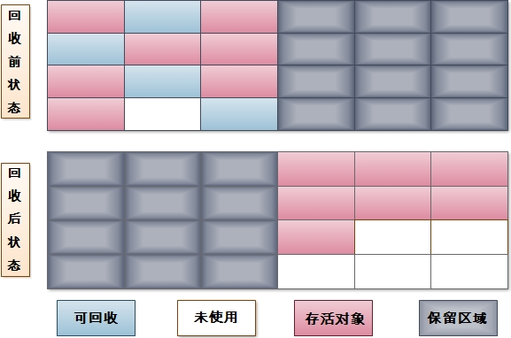
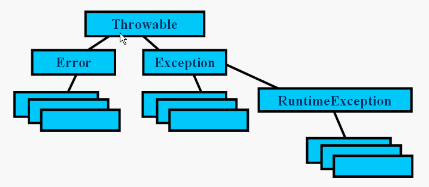

# <center>基础篇</center>

## 1.JVM
### 1.1 内存模型
线程共享区: 堆、方法区  
线程私有区: 虚拟机栈、本地方法栈、程序计数器  

**堆**  
用于存放生成的对象和数组,是线程共享区域,GC的主要区域  
由于GC采用**分代收集算法**,所以堆被大致分为**新生代和老年代**  

新生代:用于存放刚创建的对象,细分为eden和survivor(from和to),一般默认分配空间为8:2(8:1:1),默认分配可以通过启动参数修改(-XX:SurvivorRatio).
由于JVM每次都会使用eden和survivor中的一块区域来服务,所以一般实际可用率为90%,一般GC会频繁光顾新生代,多次没有被回收的对象则进入老年代。采用复制算法进行回收。 

年老代:用于存放存活率相对较高的对象。采用标记-清除算法进行回收。    
1.大对象直接进入老年代、  
2.(固定计算判断)新生代中每次回收都会对存活的对象进行标记,默认标记15次后进入老年代、  
3.(动态判断)当survivor中某一计数阶段的对象超过半数,则大于该计数阶段的对象进入老年代

**方法区**
用于存放类的信息、常量、静态变量、编译后的代码。   
当方法区无法满足内存分配时,抛出OutOfMemoryError  

方法区的回收:  
1.没有任何对象引用的常量和引用符号(编译后用于描述类、接口、方法、字段名),当内存回收时,被清除。   
2.该类所有的实例都已经被回收,也就是java堆中不存在该类的任何实例  
3.加载该类的ClassLoader已经被回收。  
4.该类对应的java.lang.Class对象没有任何地方被引用,无法在任何地方通过反射访问该类的方法。    
    

**虚拟机栈**  
虚拟机栈(JVM栈)是描述java方法执行的内存模型,是线程私有的。  
每个线程包含一个栈区,栈中只保存基本数据类型的对象和自定义对象的引用  
每个栈中的基本数据类型和自定义对象的引用都是私有的。  
栈分为3个部分：基本类型变量,执行环境上下文,操作指令区(存放操作指令)  
在函数中定义的一些基本类型的变量数据对象的引用变量都在函数的栈内存中分配   
当在一段代码块中定义一个变量时,jVM就在栈中为这个变量分配内存空间,当该变量退出该作用域后,jvm就会释放为改变量所分配的内存空间。  
在JVM栈这个数据区可能会发生抛出两种错误：  
1.StackOverflowError 出现在栈内存设置成固定值的时候,当程序执行需要的栈内存超过设定的固定值会抛出这个错误。   
2.OutOfMemoryError 出现在栈内存设置成动态增长的时候,当JVM尝试申请的内存大小超过了其可用内存时会抛出这个错误 


**本地方法栈**  
支持使用其他类型方法调用(例如C\C++)的栈
本地方法栈和JVM栈是相似的,只不过服务对象不一样。

**程序计数器**   
java是支持多线程的,线程之间就要根据时间片轮询抢夺CPU时间资源,当CPU执行一个时间片时候切换到其他线程之后,为了下一次CPU执行时能回到正确的执行位置,所以每一个线程都会创建一个程序计数器用于记录正在执行的字节码地址。  


### 1.2 垃圾回收  
  垃圾回收可以有效的防止内存泄漏,有效的利用空闲内存。 
  其中程序计算器、虚拟机栈、本地方法栈为线程私有,消亡跟线程有关。所以垃圾回收主要针对堆和方法区。   
  
  **垃圾回收算法**   
    1.标记-清除算法   
      字面意思,标记需要回收的对象,完成后进行回收。   
      优点:基础算法,后续所有算法都在其基础上进行改进。   
      缺点:由于内存分配时是一串连续的内存块,清除其中某一块之后就会变成断断续续的不连续的内存碎片。导致再为大对象分配内存的时候,无法找到足够的连续内存,从而提前触发垃圾回收。 
        
    2.复制算法  
    将现有的内存空间分成2份,每次使用其中的一份。当中一份快用完时,将其中的存活的复制到另一份之中,然后清除当前方便下次使用。  
      优点:每次都是对整个半区进行清理,不用考虑内存碎片问题    
      缺点:利用率低,内存为原来的一半。 
          
    3.标记-整理算法   
      不止标记清除对象,还对存活的对象进行位移操作,更新对象指针。    
      优点:不会存在内存碎片   
      缺点:标记+清除+位移,相对其他算法成本高。   
         
    4.分代回收算法   
      分代就是其他算法的结合,根据具体事件具体对待,所以采用不同位置采用不同算法。java堆一般分为两块即新生代和老年代,区别对待为新生代存活对象少所以采用复制算法,老年代存活对象多所以采用标记整理算法。 

  ----
  **垃圾回收执行机制**   
  现在jvm一般都采用分代回收算法,即新生代采用Minor GC、老年代采用Full GC(Major GC)   

  Minor GC:当eden满了,在创建对象申请内存时触发。将存活对象放入survivor。  
  Full GC:对整个堆进行清理,一般伴随着至少一次的Minor GC,因为Full GC非常慢,所以应尽量减小Full GC的次数。 
  
  **垃圾回收器**   
  垃圾回收器是垃圾回收算法的理论实践、具体实现。  

  新生代收集器   
  **Serial收集器**:复制算法、单线程、串行、简单高效。   
  **ParNew收集器**:Serial的多线程版。  
  **Parallel Scavenge收集器**:复制算法、多线程、并行、CPU利用率高。  

  老年代收集器  
  **Serial Old收集器**:复制算法、单线程、串行。   
  **Parallel Old收集器**:Parallel Scavenge的老年代版本。  
  **CMS收集器**:标记-清除算法、高并发、低停顿。  

  **G1收集器:JDK1.7提供的一个新的收集器。G1整体上采用标记-整理算法,但是从局部上来看采用的是复制算法。对整个堆进行清理。**  

  |收集器|并发或并行|堆分区|算法|目标|使用场景|
  | :---:                | :----:       | :----:   | :----:            |  :----:      | :----:        |
  |Serial                |串行          |新生代     |复制算法            |响应速度优先    |单CPU环境下的Client模式    |
  |Serial Old	         |串行          |老年代     |标记-整理           |响应速度优先    |单CPU环境下的Client模式、CMS的后备预案 |
  |ParNew                |并行          |新生代     |复制算法	           |响应速度优先    |多CPU环境时在Server模式下与CMS配合 |
  |Parallel Scavenge     |并行          |新生代     |复制算法            |吞吐量优先      |在后台运算而不需要太多交互的任务   |
  |Parallel Old          |并行          |老年代     |标记-整理           |吞吐量优先      |在后台运算而不需要太多交互的任务   |
  |CMS                   |并发          |老年代     |标记-清除           |响应速度优先    |集中在互联网站或B/S系统服务端上的Java应用  |
  |G1                    |并发          |整个堆     |标记-整理+复制算法   |响应速度优先    |面向服务端应用,将来替换CMS   |
      
  <sup>
  注:吞吐量就是CPU用于运行用户代码的时间与CPU总消耗时间的比值,即吞吐量 = 运行用户代码时间 /(运行用户代码时间 + 垃圾收集时间)。   
  例如:虚拟机总共运行了100分钟,其中垃圾收集花掉1分钟,那吞吐量就是99%。  
  </sup>

  **GC的庞氏骗局**   
  虽然GC在大多数情况下还是正常的,但有时候JVM也会发生欺骗你的场景, JVM不停的在垃圾回收,可是每次回收完后堆却还是满的,很明显程序内存被使用完了,已经无法正常工作了,但JVM就是不抛出OutOfMemoryError(OOM)这个异常来告诉程序员内部发出了什么,只是不停的做老好人尝试帮我们做垃圾回收,把服务器的资源耗光了。   

  出现这种现象的一种典型情况就是GC的GCTimeLimit和GCHeapFreeLimit参数设置不合适。GCTimeLimit的默认值是98%,也就是说如果大于等于98%的时间都用花在GC上,则会抛出OutOfMemoryError。GCHeapFreeLimit是回收后可用堆的大小,默认值是2%,也就是说只要有多余2%的内存可用就认为此次gc是成功的。如果GCTimeLimit设置过大或者GCHeapFreeLimit设置过小那么就会造成GC的庞式骗局,不停地进行垃圾回收。   


### 1.3 JVM基本参数  

  查看正在运行的jvm进行:  jps   
  查询正在运行的jvm参数:  jinfo -flags <pid>  
  jvm性能分析:  jvisualvm

  -Xms:初始堆大小,如果空余内存小于40%就会逐渐增大,直到最大值。(例:-Xms128m)   
  
  -Xmx:最大堆大小,如果空余内存大于70%就会组件减小,直到最小值。(例:-Xmx128m)  

  -Xmn:设置新生代大小,如果设置过大则会减少老年代大小。Sun官方建议堆内存的3/8。默认为堆内存的1/3。(例:-Xmn128m)  

  -XX:NewSize:同-Xmn一样。(例:-XX:NewSize=2m)  

  -XX:MaxNewSize:新生代最大值。(例:-XX:MaxNewSize=2m) 

  -XX:PermSize:设置持久代大小。(例:-XX:PermSize=64m)   
  
  -XX:MaxPermSize:设置持久代最大值。(整个堆大小=年轻代大小 + 年老代大小 + 持久代大小)(例:-XX:MaxPermSize=64m)    

  -Xss:每个线程栈的大小。默认1M。(例:-Xss256K)  

  -XX:ThreadStackSize:与XSS效果一致,但是Xss是jvm标准推荐使用。具体效果上与Xss有一定差异。(例:-XX:ThreadStackSize=512)  

  -XX:NewRatio:新生代与老年代比值,默认为2。(例:-XX:NewRatio=2)

  -XX:SurvivorRatio:新生代eden和survivor的比值默认为1:8。(例:-XX:SurvivorRatio=8)

  -XX:LargePageSizeInBytes:设置内存页的大小默认4m。(内存页:使用虚拟地址替代物理地址,虚拟地址与物理地址需要通过映射才能使CPU找到。映射就需要存储映射表,而映射表存放的地方就是页表)(例:-XX:LargePageSizeInBytes=4m)

  -XX:+UseFastAccessorMethods:使用原始类型快速优化。(跳过一些方法的编译,JDK1.7默认为false)(例:-XX:UseFastAccessorMethods)   

  -XX:+DisableExplicitGC:关闭代码中System.gc()的调用。(例:-XX:+DisableExplicitGC)  

  -XX:MaxTenuringThreshold:设置新生代进入老年代计数次数,默认为15次(例:-XX:MaxTenuringThreshold=15)  

  -XX:+AggressiveOpts:加快编译。(-XX:+AggressiveOpts)  

  -XX:+UseBiasedLocking:优化锁的机制,官方文档上说大部分情况下有加速效果,但在某种情况下会减慢运行速度。(例:-XX:+UseBiasedLocking)  

  -Xnoclassgc:禁用垃圾回收。(例:-Xnoclassgc)

  -XX:SoftRefLRUPolicyMSPerMB:这个参数比较有用的,官方解释是：Soft reference在虚拟机中比在客户集中存活的更长一些。其清除频率可以用命令行参数 -XX:SoftRefLRUPolicyMSPerMB=<N>来控制,这可以指定每兆堆空闲空间的 soft reference 保持存活(一旦它不强可达了)的毫秒数,这意味着每兆堆中的空闲空间中的 soft reference 会(在最后一个强引用被回收之后)存活1秒钟。注意,这是一个近似的值,因为  soft reference 只会在垃圾回收时才会被清除,而垃圾回收并不总在发生。系统默认为一秒,我觉得没必要等1秒,客户集中不用就立刻清除,改为 -XX:SoftRefLRUPolicyMSPerMB=0(例:-XX:SoftRefLRUPolicyMSPerMB=0)  

  -XX:PretenureSizeThreshold:设置生成的对象超过多少就直接进入老年代。(例:-XX:PretenureSizeThreshold=3M)  

  -XX:+PrintGC:输出GC日志。(例:-XX:+PrintGC)  

  -XX:+PrintGCDetails:输出详细日志。(例:-XX:+PrintGCDetails)    

  -XX:+PrintGCTimeStamps:在输出GC日志的前面加上时间,一般跟PrintGC混用。例如-XX:+PrintGC:PrintGCTimeStamps(例:-XX:+PrintGCTimeStamps)   

  -XX:+PrintGCApplicationStoppedTime:打印垃圾回收期间程序暂停的时间。(例:-XX:+PrintGCApplicationStoppedTime)  

  -XX:+PrintGCApplicationConcurrentTime:垃圾回收用了多少时间。(例:-XX:+PrintGCApplicationConcurrentTime)  

  -XX:PrintHeapAtGC:打印GC前后的详细堆栈信息。(例:-XX:PrintHeapAtGC)  

  -Xloggc:打印垃圾回收日志。(例:-Xloggc:/srv/jvm.log)  

  -XX:-PrintTenuringDistribution:打印存活对象的标记次数。(例:-XX:-PrintTenuringDistribution)   

  <sup>更多详细参数见:[官方链接](http://www.oracle.com/technetwork/articles/java/vmoptions-jsp-140102.html)</sup>  


### 1.4 JVM性能监控  
  jps:显示当前用户下所以java进程的pid  

  - jps -q:只显示pid   
  - jps -m:输出传递给main方法的参数   
  - jps -l:输出应用程序main class的完整package名  
  - jps -v:输出传递给JVM的参数  

  jstack:jstack <pid\>将当前java进程的线程堆栈打印出来   

  - prio:线程的优先级   
  - tid:线程id   
  - nid:操作系统映射的线程id   

  线程的状态   

  - New:当线程对象创建时存在的状态,此时线程不可能执行   
  - Runnable:当调用thread.start()后,线程变成为Runnable状态   
  - Running:线程正在执行   
  - Waiting:执行thread.join()或在锁对象调用obj.wait()等情况就会进该状态,表明线程正处于等待某个资源或条件发生来唤醒自己   
  - Timed_Waiting:执行Thread.sleep(long)、thread.join(long)或obj.wait(long)等就会进该状态,与Waiting的区别在于Timed_Waiting的等待有时间限制   
  - Blocked:如果进入同步方法或同步代码块,没有获取到锁,则会进入该状态   
  - Dead:线程执行完毕,或者抛出了未捕获的异常之后,会进入dead状态,表示该线程结束   
  - Deadlock:表示有死锁   
  - Waiting on condition:等待某个资源或条件发生来唤醒自己   
  - Blocked:阻塞   
  - Waiting on monitor entry:在等待获取锁   
  - in Object.wait():获取锁后又执行obj.wait()放弃锁  

  jmap:显示某个进程内物理内存情况   
  
  - jmap -finalizerinfo<pid\>:打印正等候回收的对象的信息  
  - jmap -heap<pid\>:打印heap的概要信息,GC使用的算法,heap的配置及wise heap的使用情况.  
  - jmap -histo[:live]<pid\>:打印每个class的实例数目,内存占用,类全名信息. VM的内部类名字开头会加上前缀”*”. 如果live子参数加上后,只统计活的对象数量  
  - jmap -F 强迫.在pid没有相应的时候使用-dump或者-histo参数. 在这个模式下,live子参数无效    
  - jmap -J<参数> 传递参数给jmap启动的jvm. 
  - jmap -dump:[live]format=b,file=<filename>:使用二进制形式,输出jvm的heap内容到文件=. live子选项是可选的,假如指定live选项,那么只输出活的对象到文件   

  jstat:  

  jconsole:  

  jinfo:  

  jhat:  

### 1.5 JVM编译与反编译  
  javac:将代码编译成与平台无关的字节码文件

  - -g                         生成所有调试信息  
  - -g:none                    不生成任何调试信息   
  - -g:{lines,vars,source}     只生成某些调试信息   
  - -nowarn                    不生成任何警告   
  - -verbose                   输出有关编译器正在执行的操作的消息   
  - -deprecation               输出使用已过时的 API 的源位置  
  - -classpath <路径>            指定查找用户类文件的位置   
  - -cp <路径>                   指定查找用户类文件的位置   
  - -sourcepath <路径>           指定查找输入源文件的位置   
  - -bootclasspath <路径>        覆盖引导类文件的位置  
  - -extdirs <目录>              覆盖安装的扩展目录的位置   
  - -endorseddirs <目录>         覆盖签名的标准路径的位置   
  - -d <目录>                    指定存放生成的类文件的位置   
  - -encoding <编码>             指定源文件使用的字符编码   
  - -source <版本>               提供与指定版本的源兼容性   
  - -target <版本>               生成特定 VM 版本的类文件  
  - -version                   版本信息   
  - -help                      输出标准选项的提要   
  - -X                         输出非标准选项的提要  
  - -J<标志>                     直接将 <标志> 传递给运行时系统   
  - -Werror                     遇到警告停止编译   
  - @<filename\>                从文件中读取选项和文件名  
  - 示例:javac -encoding gbk -cp ../IntelliJ\ IDEA\ Project/test_one/lib/junit-4.11.jar:../IntelliJ\ IDEA\ Project/test_one/lib/log4j-1.2.17.jar @list.txt -d out/   

  javap:JDK自带的反汇编器,可以查看java编译器为我们生成的字节码  

  - -help 帮助  
  - -version 版本信息  
  - -verbose(-v) 输出栈大小,方法参数的个数   
  - -l 输出行和变量的表  
  - -public 只输出public方法和域  
  - -protected 只输出public和protected类和成员  
  - -package 只输出包,public和protected类和成员,这是默认的  
  - -private(-p) 输出所有类和成员  
  - -s 输出内部类型签名   
  - -c 输出分解后的代码,例如,类中每一个方法内,包含java字节码的指令  
  - -sysinfo 显示正在处理的类的系统信息(路径、大小、日期、MD5哈希)     
  - -constants 输出静态final常量    
  - -classpath <pathlist\>  指定javap用来查找类的路径。目录用：分隔   
  - -bootclasspath <path\> 重写引导类文件的位置   

  jd-gui:java 反编译可视化工具  

  - [https://github.com/java-decompiler/jd-gui](https://github.com/java-decompiler/jd-gui)   
  - 下载源码,根据下面系统类型,编译成对应的可运行的程序。   

  jdk对应的版本:   

  |jdk版本|minor.major|
  |:---:|:-----:|
  |JDK1.1|45| 
  |JDK1.2|46|
  |JDK1.3|47|
  |JDK1.4|48|
  |JDK1.5|49|
  |JDK1.6|50|
  |JDK1.7|51|
  |JDK1.8|52|
  |JDK1.9|53|

### 1.6 JAVA类加载 
  启动类加载器(bootstarp ClassLoader):   
  &emsp;&emsp;C++实现,用于加载jre/lib下的指定文件。也可以使用-Xbootclasspath加载指定jar。由于涉及到虚拟机实现细节,不允许直接获取。  

  扩展类加载器(Extension ClassLoader):   
  &emsp;&emsp;由ExtClassLoader类实现,用于加载jre/lib/ext下面全部文件。也可以使用-Djava.ext.dir加载指定jar。可以获取。   

  系统类加载器(System ClassLoader):   
  &emsp;&emsp;由AppClassLoader类实现,用于加载用户第三方类库,也可以使用-Djava.class.path加载指定jar。可以获取   

  类的加载:    
  &emsp;&emsp;1.获取类的文件字节流     
  &emsp;&emsp;2.将字节流获取的信息储存在方法区   
  &emsp;&emsp;3.在堆中生成一个Class对象,指向方法区存储的对象   

  双亲委派:    
  &emsp;&emsp;加载类的时候,递归调用父级类加载器,委托父类加载,最终都会到顶层类加载器中,而顶层的类加载器中会先判断该类是否已经被加载,或者加载改类。当该类无法加载时,子加载器才会自己加载。(自下而上的判断是否被加载,自下而上的尝试加载类)这样就保证了一个类在不同加载器环境中获取到的是同一个类。破坏双亲委托一般重写加载器的loadClass方法。

---------
## <center>2.基础篇</center>

### 2.1 基本类型
|类型名称|类型描述|封装器类|类型取值|
|:---:|:----:|:----:|:----:|
|boolean|一个信息比特|Boolean|true, false|
|byte|一种8位有正负的二进制整数|Byte|最小值-128,最大值127|
|short|一种16位有正负的二进制整数|Short|最小值-32768,最大值32767|
|int|一种32位有正负的二进制整数|Integer|最小值-2147483648(-231),最大值2147483647(231-1)|
|long|一种64位有正负的二进制整数|Long|-263~(263-1)|
|float|一种单精度的32位IEEE754标准下的浮点数据|Float|1.4E-45~3.4028235E38|
|double|一种双精度的64位IEEE754标准下的浮点数据|Double|4.9E-324~1.7976931348623157E308|
|char|16位Unicode标准下的字符|Character|    |

### 2.2 String
  JDK 6和JDK 7中substring的原理及区别:
```java
  ////JDK1.6
  String(int offset, int count, char value[]) {
    this.value = value;
    this.offset = offset;
    this.count = count;
  }

  public String substring(int beginIndex, int endIndex) {
      return  new String(offset + beginIndex, endIndex - beginIndex, value);
  }
```  

```java  
////JDK 7
public String(char value[], int offset, int count) {
    this.value = Arrays.copyOfRange(value, offset, offset + count);
}

public String substring(int beginIndex, int endIndex) {
    int subLen = endIndex - beginIndex;
    return new String(value, beginIndex, subLen);
}
```
从代码上看JDK1.6引用的是一整个字符串。如果这个字符串很大,当其中截取小的一部分引用的时候,会导致原来被引用的整个字符串无法回收。而JDK1.7是重新生成一个新的字符串。    

### 2.3 字符串的不可变性   
  1.字符串常量池的需要   
  &emsp;&emsp;当创建一个String对象时,假如此字符串值已经存在于常量池中,则不会创建一个新的对象,而是引用已经存在的对象。  
  2.允许String对象缓存HashCode   
  &emsp;&emsp;字符串不变性保证了hash码的唯一性,因此可以放心地进行缓存,这也是一种性能优化手段,意味着不必每次都去计算新的哈希码。  
  3.安全性  
  &emsp;&emsp;同一个字符串实例可以被多个线程共享   

### 2.4 自动装箱与拆箱  
  装箱:将值转化成对象。一般调用对象的valueOf()方法   
  拆箱:将对象转化成值。一般调用对象的xxxValue()方法  
  ***需要注意的是:  
  &emsp;&emsp;Integer、Short、Byte、Character、Long这几个类的valueOf方法的实现是类似的。JVM会自动缓存-128~127的对象(Character缓存0~127),如果超过则会重新创建。   
  &emsp;&emsp;Double、Float的valueOf方法的实现是类似的。直接重新创建。   
  &emsp;&emsp;Boolean的valueOf方法返回的是2个静态成员。   ***

|值|对象|大小|
|:---:|:---:|:---:|
|byte|Byte|8字节|
|short|Short|16字节|
|char|Character|16字节|
|int|Integer|32字节|
|long|Long|64字节|
|float|Float|32字节|
|double|Double|64字节|
|boolean|Boolean|1字节|

```java
public class Main {
    public static void main(String[] args) {
         
        Boolean i1 = false;
        Boolean i2 = false;
        Boolean i3 = true;
        Boolean i4 = true;
        System.out.println(i1==i2);////true
        System.out.println(i3==i4);////true

        Integer i1 = 100;
        Integer i2 = 100;
        Integer i3 = 200;
        Integer i4 = 200;
        System.out.println(i1==i2);////true
        System.out.println(i3==i4);////false

        Double i1 = 100.0;
        Double i2 = 100.0;
        Double i3 = 200.0;
        Double i4 = 200.0;
        System.out.println(i1==i2);////false
        System.out.println(i3==i4);////false
    }
}
```
### 2.5 关键字  
|abstract |class    |extends |implements |null      |strictfp     |true|
|:---:|:---:|:---:|:---:|:---:|:---:|:---:|
|assert   |const    |false   |import     |package   |super        |try|
|boolean  |continue |final   |instanceof |private   |switch       |void|
|break    |default  |finally |int        |protected |synchronized |volatile|
|byte     |do       |float   |interface  |public    |this         |while|
|case     |double   |for     |long       |return    |throw        ||
|catch    |else     |goto    |native     |short     |throws       ||
|char     |enum     |if      |new        |static    |transient    ||

transient:与Serializable搭配使用阻止属性序列化。(transient与Externalizable接口同时使用是将无效)    
volatile:与synchronized相比无法保证操作的原子性。操作不依赖当前值、不包含在其他变量的不变式中。    

### 2.6 集合类  
Collection  
&emsp;|-- List  
&emsp;|&emsp;&emsp;|-- LinkedList  
&emsp;|&emsp;&emsp;|-- ArrayList  
&emsp;|&emsp;&emsp;|-- Vector   
&emsp;|&emsp;&emsp;&emsp;&emsp;|-- Stack   
&emsp;|-- Set  
&emsp;|&emsp;&emsp;|-- HashSet    
&emsp;|&emsp;&emsp;&emsp;&emsp;|-- LinkedHashSet  
&emsp;|&emsp;&emsp;|-- SortedSet  
&emsp;|&emsp;&emsp;&emsp;&emsp;|-- TreeSet  

Map   
&emsp;|-- HashMap   
&emsp;|&emsp;&emsp;|-- LinkedHashMap   
&emsp;|-- Hashtable   
&emsp;|-- TreeMap   
&emsp;|-- WeakHashMap   

LinkedList:   
&emsp;&emsp;LinkedList的本质是双向链表。线程不同步   
```java
(虽然标明了不序列化,但是实现了writeObject和readObject)
transient int size = 0;  //元素总个数
transient Node<E> first; //头指针
transient Node<E> last;  //尾指针
```
```java
//元素实例
private static class Node<E> {
    E item;//节点储存值   
    Node<E> next;//下一个节点
    Node<E> prev;//上一个节点

    Node(Node<E> prev, E element, Node<E> next) {
        this.item = element;
        this.next = next;
        this.prev = prev;
    }
}
```
```java
public boolean add(E e) {
    linkLast(e);
    return true;
}
void linkLast(E e) {
    final Node<E> l = last;  //获取尾元素
    final Node<E> newNode = new Node<>(l, e, null); //创建一个新的尾元素
    last = newNode; //将尾指针指向尾元素
    if (l == null)
        first = newNode;
    else
        l.next = newNode;   //将尾元素前一个元素对象的下一个节点指向尾元素
    size++;  //元素总个数+1
    modCount++;  //修改次数+1
}
public void add(int index, E element) {
    checkPositionIndex(index);  //检查是否下标越界
    if (index == size)
        linkLast(element);
    else
        linkBefore(element, node(index)); 
}
```
```java
void linkBefore(E e, Node<E> succ) {
    final Node<E> pred = succ.prev;   //获取指定元素的前一个元素
    final Node<E> newNode = new Node<>(pred, e, succ);  //创建一个新元素位于指定元素前
    succ.prev = newNode  //修改指定元素的上一个节点
    if (pred == null)
        first = newNode;
    else
        pred.next = newNode;  //修改指定元素前一个元素的下一个节点
    size++;  //元素总个数+1
    modCount++;//修改次数+1
}
```
```java
//采用位移计算index是否小于size的一半,小于则从链表头开始找,大于则从链表尾开始找。
Node<E> node(int index) {
    if (index < (size >> 1)) {   
        Node<E> x = first;
        for (int i = 0; i < index; i++)
            x = x.next;
        return x;
    } else {
        Node<E> x = last;
        for (int i = size - 1; i > index; i--)
            x = x.prev;
        return x;
    }
}
```
```java
public E set(int index, E element) {
    checkElementIndex(index);
    Node<E> x = node(index);
    E oldVal = x.item;
    x.item = element;
    return oldVal;
}
```
```java
public E remove(int index) {
    checkElementIndex(index);
    return unlink(node(index));
}
E unlink(Node<E> x) {
    final E element = x.item;
    final Node<E> next = x.next;
    final Node<E> prev = x.prev;

    if (prev == null) {
        first = next;
    } else {
        prev.next = next;
        x.prev = null;
    }

    if (next == null) {
        last = prev;
    } else {
        next.prev = prev;
        x.next = null;
    }

    x.item = null;
    size--;
    modCount++;
    return element;
}
```

ArrayList:  
&emsp;&emsp;ArrayList 本质上就是一个数组。线程不同步
```java
//默认初始容量
private static final int DEFAULT_CAPACITY = 10;
//用于空实例共享空数组实例。
private static final Object[] EMPTY_ELEMENTDATA = {};
//默认的空数组
private static final Object[] DEFAULTCAPACITY_EMPTY_ELEMENTDATA = {};
//存放元素的数组
(虽然标明了不序列化,但是实现了writeObject和readObject)
transient Object[] elementData;
//大小,创建对象时Java会将int初始化为0
private int size;
```
```java
public boolean add(E e) {
    //检查数组容量
    ensureCapacityInternal(size + 1);
    elementData[size++] = e;
    return true;
}
private void ensureCapacityInternal(int minCapacity) {
    //使用默认值和参数中较大者作为容量预设值
    if (elementData == DEFAULTCAPACITY_EMPTY_ELEMENTDATA) {
        minCapacity = Math.max(DEFAULT_CAPACITY, minCapacity);
    }
    //检查容量
    ensureExplicitCapacity(minCapacity);
}
private void ensureExplicitCapacity(int minCapacity) {
    //修改次数+1
    modCount++; 
    //如果当前下标超过数组容量,则扩容
    if (minCapacity - elementData.length > 0)
        grow(minCapacity);
}
//默认最大数组容量
private static final int MAX_ARRAY_SIZE = Integer.MAX_VALUE - 8 = 2147483639;
private void grow(int minCapacity) {
    int oldCapacity = elementData.length;
    //增加预设容量为现有容量的一半
    int newCapacity = oldCapacity + (oldCapacity >> 1);
    if (newCapacity - minCapacity < 0)
        newCapacity = minCapacity;
    //检查预设容量是否超过最大容量
    if (newCapacity - MAX_ARRAY_SIZE > 0)
        newCapacity = hugeCapacity(minCapacity);
    //根据预设容量和原数组重新生成新数组
    elementData = Arrays.copyOf(elementData, newCapacity);
}
//检查预设容量是否超过最大,如果没有超过则返回最大,如果超过则报错
private static int hugeCapacity(int minCapacity) {
    if (minCapacity < 0)
        throw new OutOfMemoryError();
    return (minCapacity > MAX_ARRAY_SIZE) ?
        Integer.MAX_VALUE :
        MAX_ARRAY_SIZE;
}
```
```java
public E get(int index) {
    //检查index是否越界
    rangeCheck(index);
    return elementData(index);
}
private void rangeCheck(int index) {
    if (index >= size)
        throw new IndexOutOfBoundsException(outOfBoundsMsg(index));
}
```
```java
public E set(int index, E element) {
    rangeCheck(index);
    E oldValue = elementData(index);
    elementData[index] = element;
    return oldValue;
}
```
```java
public E remove(int index) {
    rangeCheck(index);
    modCount++;
    E oldValue = elementData(index);
    int numMoved = size - index - 1;
    if (numMoved > 0)
        //利用C++编写的函数,把数组要删除的位置以后的元素往前移动一位
        //例:[1,2,3,4,5,6] -> [1,2,4,5,6,6] 删除第二个元素
        //参数：源数组,源数组起始位置,目标数组,目标数据中的起始位置,要复制的数组元素的数量
        System.arraycopy(elementData, index+1, elementData, index, numMoved);
    elementData[--size] = null;
    return oldValue;
}
```
Vector      
&emsp;&emsp;Vector 本质上也是一个数组,基本跟ArrayList用法一样。不一样就是Vector可设置扩容大小。线程同步
```java
private void grow(int minCapacity) {
    int oldCapacity = elementData.length;
    //如果不设置扩容消息默认扩容为当前2倍
    int newCapacity = oldCapacity + ((capacityIncrement > 0) ?
                                      capacityIncrement : oldCapacity);
    if (newCapacity - minCapacity < 0)
        newCapacity = minCapacity;
    if (newCapacity - MAX_ARRAY_SIZE > 0)
        newCapacity = hugeCapacity(minCapacity);
    elementData = Arrays.copyOf(elementData, newCapacity);
}
```
|区别|ArrayList|Vector|
|:---:|:---:|:---:|
|设置扩容|不能设置,默认1.5倍|可以设置,默认2倍|
|无参初始化容量|0|10|
|线程同步|不同步|同步|

多线程情况下多数使用Vector,也可以使用Collections.synchronizedList(List list)返回一个线程同步的List。   

HashMap(JDK1.8)   
&emsp;&emsp;HashMap 本质上是一个数组+链表(红黑树)。线程不同步   
&emsp;&emsp;[红黑树的介绍](https://blog.csdn.net/u011240877/article/details/53329023)   
```java
//默认初始化大小
static final int DEFAULT_INITIAL_CAPACITY = 1 << 4; // 16
//默认最大容量
static final int MAXIMUM_CAPACITY = 1 << 30;  //1073741824
//默认阈值
static final float DEFAULT_LOAD_FACTOR = 0.75f;
//链表长度超过默认值转换成红黑树
static final int TREEIFY_THRESHOLD = 8;
//红黑树长度少于默认值的时候转为链表
static final int UNTREEIFY_THRESHOLD = 6;
//数组容量大于默认值才进行红黑树转换
static final int MIN_TREEIFY_CAPACITY = 64;
//存储数据的数组
transient Node<K,V>[] table;
//平级缓存所有table的单个节点,用于遍历
transient Set<Map.Entry<K,V>> entrySet;
//已存数据的容量
transient int size;
//修改次数
transient int modCount;
//扩容临界值(容量*阈值)超过这个临界值则进行扩容
int threshold;
//阈值
final float loadFactor;
```
```java
static class Node<K,V> implements Map.Entry<K,V> {
    //hash计算得到数组的位置
    final int hash;  
    final K key;
    V value;
    //单向链接的下一个节点
    Node<K,V> next;
    Node(int hash, K key, V value, Node<K,V> next) {
        this.hash = hash;
        this.key = key;
        this.value = value;
        this.next = next;
    }
    public final K getKey()        { return key; }
    public final V getValue()      { return value; }
    public final String toString() { return key + "=" + value; }
    public final int hashCode() {...}
    public final V setValue(V newValue) {...}
    public final boolean equals(Object o) {...}
}
```
```java
public V put(K key, V value) {
    return putVal(hash(key), key, value, false, true);
}
static final int hash(Object key) {
    int h;
    //取到hash值再做一次高位运算
    return (key == null) ? 0 : (h = key.hashCode()) ^ (h >>> 16);
}
final V putVal(int hash, K key, V value, boolean onlyIfAbsent,
                boolean evict) {
    Node<K,V>[] tab; Node<K,V> p; int n, i;
    //判断table是否为空,为空这创建数组
    if ((tab = table) == null || (n = tab.length) == 0)
        n = (tab = resize()).length;
    //判断当前位置是否存在对象,不存在则根据创建对象保存
    if ((p = tab[i = (n - 1) & hash]) == null)
        tab[i] = newNode(hash, key, value, null);
    else {
        Node<K,V> e; K k;
        //判断如果计算的hash值一样且key也一样,则覆盖
        if (p.hash == hash &&
            ((k = p.key) == key || (key != null && key.equals(k))))
            e = p;
        //判断当前节点下是否为红黑树,否则为链表
        else if (p instanceof TreeNode)
            e = ((TreeNode<K,V>)p).putTreeVal(this, tab, hash, key, value);
        else {
            for (int binCount = 0; ; ++binCount) {
                if ((e = p.next) == null) {
                    //新建节点加入链表尾
                    p.next = newNode(hash, key, value, null);
                    //如果链表长度大于等于默认转换值,则进行链表转红黑树处理
                    if (binCount >= TREEIFY_THRESHOLD - 1) // -1 for 1st
                        treeifyBin(tab, hash);
                    break;
                }
                //如果key存在着覆盖
                if (e.hash == hash &&
                    ((k = e.key) == key || (key != null && key.equals(k))))
                    break;
                p = e;
            }
        }
        if (e != null) { // existing mapping for key
            V oldValue = e.value;
            if (!onlyIfAbsent || oldValue == null)
                e.value = value;
            afterNodeAccess(e);
            return oldValue;
        }
    }
    ++modCount;
    //已存数据的容量加一,并判断是否超过临界值,超过则进行扩容
    if (++size > threshold)
        resize();
    afterNodeInsertion(evict);
    return null;
}
```
```java
//链表转红黑树
final void treeifyBin(Node<K,V>[] tab, int hash) {
    int n, index; Node<K,V> e;
    //验证当前存储的数组容量是否大于默认转换红黑树的容量,否则重新计算容量
    if (tab == null || (n = tab.length) < MIN_TREEIFY_CAPACITY)
        resize();
    else if ((e = tab[index = (n - 1) & hash]) != null) {
        //链表转换成树
        TreeNode<K,V> hd = null, tl = null;
        do {
            TreeNode<K,V> p = replacementTreeNode(e, null);
            if (tl == null)
                hd = p;
            else {
                p.prev = tl;
                tl.next = p;
            }
            tl = p;
        } while ((e = e.next) != null);
        if ((tab[index] = hd) != null)
            //标记根节点,重新分配并着色
            hd.treeify(tab);
    }
}
```
```java
final Node<K,V>[] resize() {
    Node<K,V>[] oldTab = table;
    int oldCap = (oldTab == null) ? 0 : oldTab.length;
    int oldThr = threshold;
    int newCap, newThr = 0;
    if (oldCap > 0) {
        //如果容量超过最大值,则不进行扩充
        if (oldCap >= MAXIMUM_CAPACITY) {
            threshold = Integer.MAX_VALUE;
            return oldTab;
        }
        //没有超过则扩容为原来的2倍
        else if ((newCap = oldCap << 1) < MAXIMUM_CAPACITY &&
                  oldCap >= DEFAULT_INITIAL_CAPACITY)
            //临界值也扩充为原来的2倍
            newThr = oldThr << 1; 
    }
    else if (oldThr > 0) 
        newCap = oldThr;
    else {               
        newCap = DEFAULT_INITIAL_CAPACITY;
        newThr = (int)(DEFAULT_LOAD_FACTOR * DEFAULT_INITIAL_CAPACITY);
    }
    //如果新的临界值为0,重新计算临界值
    if (newThr == 0) {
        float ft = (float)newCap * loadFactor;
        newThr = (newCap < MAXIMUM_CAPACITY && ft < (float)MAXIMUM_CAPACITY ?
                  (int)ft : Integer.MAX_VALUE);
    }
    //更新临界值
    threshold = newThr;
    //创建新的扩容数组
    @SuppressWarnings({"rawtypes","unchecked"})
        Node<K,V>[] newTab = (Node<K,V>[])new Node[newCap];
    table = newTab;
    if (oldTab != null) {
        //循环复制
        for (int j = 0; j < oldCap; ++j) {
            Node<K,V> e;
            if ((e = oldTab[j]) != null) {
                oldTab[j] = null;
                //如果之前的是单个对象,则直接复制
                if (e.next == null)
                    newTab[e.hash & (newCap - 1)] = e;
                //之前为红黑树,则新对象也为红黑树
                else if (e instanceof TreeNode)
                    ((TreeNode<K,V>)e).split(this, newTab, j, oldCap);
                else { 
                    //之前为链表,新对象也为链表
                    Node<K,V> loHead = null, loTail = null;
                    Node<K,V> hiHead = null, hiTail = null;
                    Node<K,V> next;
                    do {
                        next = e.next;
                        if ((e.hash & oldCap) == 0) {
                            if (loTail == null)
                                loHead = e;
                            else
                                loTail.next = e;
                            loTail = e;
                        }
                        else {
                            if (hiTail == null)
                                hiHead = e;
                            else
                                hiTail.next = e;
                            hiTail = e;
                        }
                    } while ((e = next) != null);
                    if (loTail != null) {
                        loTail.next = null;
                        newTab[j] = loHead;
                    }
                    if (hiTail != null) {
                        hiTail.next = null;
                        newTab[j + oldCap] = hiHead;
                    }
                }
            }
        }
    }
    return newTab;
}
```
```java
public V get(Object key) {
    Node<K,V> e;
    return (e = getNode(hash(key), key)) == null ? null : e.value;
}
final Node<K,V> getNode(int hash, Object key) {
    Node<K,V>[] tab; Node<K,V> first, e; int n; K k;
    if ((tab = table) != null && (n = tab.length) > 0 &&
        (first = tab[(n - 1) & hash]) != null) {
        //根据hash值找到当前对象,如果当前对象key值也相等这直接返回
        if (first.hash == hash && 
            ((k = first.key) == key || (key != null && key.equals(k))))
            return first;
        //如果hash值相等,且存在链表或树,则遍历
        if ((e = first.next) != null) {
            //如果是红黑树,则调用节点查找
            if (first instanceof TreeNode)
                return ((TreeNode<K,V>)first).getTreeNode(hash, key);
            //链表这循环查找
            do {
                if (e.hash == hash &&
                    ((k = e.key) == key || (key != null && key.equals(k))))
                    return e;
            } while ((e = e.next) != null);
        }
    }
    return null;
}
final TreeNode<K,V> getTreeNode(int h, Object k) {
    return ((parent != null) ? root() : this).find(h, k, null);
}
final TreeNode<K,V> find(int h, Object k, Class<?> kc) {
    TreeNode<K,V> p = this;
    do {
        int ph, dir; K pk;
        TreeNode<K,V> pl = p.left, pr = p.right, q;
        if ((ph = p.hash) > h)
            p = pl;
        else if (ph < h)
            p = pr;
        else if ((pk = p.key) == k || (k != null && k.equals(pk)))
            return p;
        else if (pl == null)
            p = pr;
        else if (pr == null)
            p = pl;
        //如果不是按照hash值排序,那么就通过比较器返回下一个节点
        else if ((kc != null ||
                  (kc = comparableClassFor(k)) != null) &&
                  (dir = compareComparables(kc, k, pk)) != 0)
            p = (dir < 0) ? pl : pr;
        else if ((q = pr.find(h, k, kc)) != null)
            return q;
        else
            p = pl;
    } while (p != null);
    return null;
}
```
```java
public V remove(Object key) {
    Node<K,V> e;
    return (e = removeNode(hash(key), key, null, false, true)) == null ?
        null : e.value;
}
final Node<K,V> removeNode(int hash, Object key, Object value,
                            boolean matchValue, boolean movable) {
    Node<K,V>[] tab; Node<K,V> p; int n, index;
    if ((tab = table) != null && (n = tab.length) > 0 &&
        (p = tab[index = (n - 1) & hash]) != null) {
        Node<K,V> node = null, e; K k; V v;
        //直接找到
        if (p.hash == hash &&
            ((k = p.key) == key || (key != null && key.equals(k))))
            node = p;
        else if ((e = p.next) != null) {
            //在红黑树种查找
            if (p instanceof TreeNode)
                node = ((TreeNode<K,V>)p).getTreeNode(hash, key);
            else {
                //在链表中查找
                do {
                    if (e.hash == hash &&
                        ((k = e.key) == key ||
                          (key != null && key.equals(k)))) {
                        node = e;
                        break;
                    }
                    p = e;
                } while ((e = e.next) != null);
            }
        }
        if (node != null && (!matchValue || (v = node.value) == value ||
                              (value != null && value.equals(v)))) {
            //红黑树删除
            if (node instanceof TreeNode)
                ((TreeNode<K,V>)node).removeTreeNode(this, tab, movable);
            //链表第一个直接删除
            else if (node == p)
                tab[index] = node.next;
            else
                //链表中删除
                p.next = node.next;
            ++modCount;
            --size;
            afterNodeRemoval(node);
            return node;
        }
    }
    return null;
}
```

LinkedHashMap    
&emsp;&emsp;LinkedHashMap是HashMap的子类,保存了插入的顺序。线程不同步   
```java
public class LinkedHashMap<K,V> extends HashMap<K,V>
    implements Map<K,V>
{
  // 双向链表的节点
   static class Entry<K,V> extends HashMap.Node<K,V> {
        Entry<K,V> before, after;
        Entry(int hash, K key, V value, Node<K,V> next) {
            super(hash, key, value, next);
        }
    }
    //双向链表的头部
    transient LinkedHashMap.Entry<K,V> head;
    //双向列表的尾部
    transient LinkedHashMap.Entry<K,V> tail;
    //迭代顺序
    //true 访问顺序迭代  false 插入顺序迭代
    final boolean accessOrder;
   ...
}
```

HashTable   
&emsp;&emsp;HashTable与HashMap类似,内部存储结构不一样,不允许记录的键或者值为空。Hashtable不建议使用,可以使用ConcurrentHashMap替代。线程同步
```java
//存储数据的数组
private transient Entry<?,?>[] table;
//已存数据的容量
private transient int count;
//扩容临界值(容量*阈值)超过这个临界值则进行扩容
private int threshold;
//阈值
private float loadFactor;
//修改次数
private transient int modCount = 0;
//缓存所以数据的key值
private transient volatile Set<K> keySet;
//平级缓存所有table的单个节点,用于遍历
private transient volatile Set<Map.Entry<K,V>> entrySet;

private static class Entry<K,V> implements Map.Entry<K,V> {
    final int hash;
    final K key;
    V value;
    //单向链表的下一个节点
    Entry<K,V> next;

    protected Entry(int hash, K key, V value, Entry<K,V> next) {
        this.hash = hash;
        this.key =  key;
        this.value = value;
        this.next = next;
    }
    ...
}

public synchronized V put(K key, V value) {
    if (value == null) {
        throw new NullPointerException();
    }
    Entry<?,?> tab[] = table;
    //获取key的hash值
    int hash = key.hashCode();
    //计算存储的位置
    int index = (hash & 0x7FFFFFFF) % tab.length;
    @SuppressWarnings("unchecked")
    //找到对应位置的节点
    Entry<K,V> entry = (Entry<K,V>)tab[index];
    //如果节点有值则循环节点,覆盖旧值
    for(; entry != null ; entry = entry.next) {
        if ((entry.hash == hash) && entry.key.equals(key)) {
            V old = entry.value;
            entry.value = value;
            return old;
        }
    }
    addEntry(hash, key, value, index);
    return null;
}
private void addEntry(int hash, K key, V value, int index) {
    modCount++;
    Entry<?,?> tab[] = table;
    //存储容量大于临界值则扩容
    if (count >= threshold) {
        rehash();
        tab = table;
        hash = key.hashCode();
        index = (hash & 0x7FFFFFFF) % tab.length;
    }
    //如果当前hash值获取到节点,那么将该节点添加到当前节点链表的头部,否则新建一个节点添加到数组的当前位置
    @SuppressWarnings("unchecked")
    Entry<K,V> e = (Entry<K,V>) tab[index];
    tab[index] = new Entry<>(hash, key, value, e);
    count++;
}
```

TreeMap   
&emsp;&emsp;TreeMap 本质是红黑树。线程不同步    
&emsp;&emsp;[TreeMap详解](https://www.cnblogs.com/emoji1213/p/7723400.html)   


WeakHashMap   
&emsp;&emsp;WeakHashMap 跟HashMap类似。数组+链表。“弱键”(可以搜索WeakReference)。线程不同步   
```java
//默认初始化容量,值为16
private static final int DEFAULT_INITIAL_CAPACITY = 16;
//最大容量
private static final int MAXIMUM_CAPACITY = 1 << 30;
//默认阈值
private static final float DEFAULT_LOAD_FACTOR = 0.75f;
//存储数据的数组
Entry<K,V>[] table;
//已存数据的容量
private int size;
//扩容临界值(容量*阈值)超过这个临界值则进行扩容
private int threshold;
//阈值
private final float loadFactor;
//被回收的“弱键”
private final ReferenceQueue<Object> queue = new ReferenceQueue<>();
//平级缓存所有table的单个节点,用于遍历
private transient Set<Map.Entry<K,V>> entrySet;
//修改次数
int modCount;

private static class Entry<K,V> extends WeakReference<Object> implements Map.Entry<K,V> {
      V value;  //值
      final int hash; //key的hash值
      Entry<K,V> next;  //下一个节点

      Entry(Object key, V value,
            ReferenceQueue<Object> queue,
            int hash, Entry<K,V> next) {
          super(key, queue);
          this.value = value;
          this.hash  = hash;
          this.next  = next;
      }
      ...
}
```
```java
public V put(K key, V value) {
    //判断空key
    Object k = maskNull(key);
    //获取hash值
    int h = hash(k);
    //获取被回收后的tab
    Entry<K,V>[] tab = getTable();
    //根据hash计算位置
    int i = indexFor(h, tab.length);
    //循环判断是否存在重复值,有则覆盖
    for (Entry<K,V> e = tab[i]; e != null; e = e.next) {
        if (h == e.hash && eq(k, e.get())) {
            V oldValue = e.value;
            if (value != oldValue)
                e.value = value;
            return oldValue;
        }
    }
    //修改次数+1
    modCount++;
    //如果当前hash值获取到节点,那么将该节点添加到当前节点链表的头部,否则新建一个节点添加到数组的当前位置
    Entry<K,V> e = tab[i];
    tab[i] = new Entry<>(k, value, queue, h, e);
    //长度大于临界值则扩容
    if (++size >= threshold)
        resize(tab.length * 2);
    return null;
}
```
```java
public V get(Object key) {
    //判断空key
    Object k = maskNull(key);
    //获取hash值
    int h = hash(k);
    //获取被回收后的tab
    Entry<K,V>[] tab = getTable();
    //根据hash计算位置
    int index = indexFor(h, tab.length);
    //获取对应位置的节点
    Entry<K,V> e = tab[index];
    //判断节点是key值是否相等,如不相等这循环查找链表
    while (e != null) {
        if (e.hash == h && eq(k, e.get()))
            return e.value;
        e = e.next;
    }
    return null;
}
```
```java
public V remove(Object key) {
    //判断空key
    Object k = maskNull(key);
    //获取hash值
    int h = hash(k);
    //获取被回收后的tab
    Entry<K,V>[] tab = getTable();
    //根据hash计算位置
    int i = indexFor(h, tab.length);
    //获取对应位置的节点
    Entry<K,V> prev = tab[i];
    Entry<K,V> e = prev;
    //循环对象节点判断key值是否相等,如果相等则删除对应链表上的节点
    while (e != null) {
        Entry<K,V> next = e.next;
        if (h == e.hash && eq(k, e.get())) {
            modCount++;
            size--;
            if (prev == e)
                tab[i] = next;
            else
                prev.next = next;
            return e.value;
        }
        prev = e;
        e = next;
    }

    return null;
}
```

|区别|HashMap|HashTable|TreeMap|WeakHashMap|
|:--:|:--:|:--:|:--:|:--:|
|数据结构|数组+链表(红黑树)|数组+链表|红黑树|数组+链表|
|线程同步|不同步|同步|不同步|不同步|
|空值|可以|不可以|不可以|可以|
|继承类|AbstractMap|Dictionary|AbstractMap|AbstractMap|
|排序|无序|无序|有序|无序|
|迭代器|Iterator|Enumeration|Iterator|Iterator|

需要线程同步可以使用 ConcurrentHashMap或者Collections.synchronizedMap()替代。   


HashSet   
&emsp;&emsp;HashSet 本质就是hashMap。
```java
public class HashSet<E>
    extends AbstractSet<E>
    implements Set<E>, Cloneable, java.io.Serializable
{
    static final long serialVersionUID = -5024744406713321676L;

    private transient HashMap<E,Object> map;

    public HashSet() {
        map = new HashMap<>();
    }

    public HashSet(Collection<? extends E> c) {
        map = new HashMap<>(Math.max((int) (c.size()/.75f) + 1, 16));
        addAll(c);
    }
   
    public HashSet(int initialCapacity, float loadFactor) {
        map = new HashMap<>(initialCapacity, loadFactor);
    }

    public HashSet(int initialCapacity) {
        map = new HashMap<>(initialCapacity);
    }

    HashSet(int initialCapacity, float loadFactor, boolean dummy) {
        map = new LinkedHashMap<>(initialCapacity, loadFactor);
    }
    ...
}
```
LinkedHashSet   
&emsp;&emsp;LinkedHashSet 本质就是LinkedHashMap。
```java
public class LinkedHashSet<E>
    extends HashSet<E>
    implements Set<E>, Cloneable, java.io.Serializable {

    private static final long serialVersionUID = -2851667679971038690L;

    public LinkedHashSet(int initialCapacity, float loadFactor) {
        super(initialCapacity, loadFactor, true);
    }

    public LinkedHashSet(int initialCapacity) {
        super(initialCapacity, .75f, true);
    }

    public LinkedHashSet() {
        super(16, .75f, true);
    }

    public LinkedHashSet(Collection<? extends E> c) {
        super(Math.max(2*c.size(), 11), .75f, true);
        addAll(c);
    }
    ...
}
```
TreeSet  
&emsp;&emsp;TreeSet 本质就是TreeMap。
```java
public class TreeSet<E> extends AbstractSet<E>
    implements NavigableSet<E>, Cloneable, java.io.Serializable
{
    private transient NavigableMap<E,Object> m;

    private static final Object PRESENT = new Object();

    TreeSet(NavigableMap<E,Object> m) {
        this.m = m;
    }

    public TreeSet() {
        this(new TreeMap<E,Object>());
    }

    public TreeSet(Comparator<? super E> comparator) {
        this(new TreeMap<>(comparator));
    }

    public TreeSet(Collection<? extends E> c) {
        this();
        addAll(c);
    }

    public TreeSet(SortedSet<E> s) {
        this(s.comparator());
        addAll(s);
    }
    ...
}
```

### 2.7 枚举   
&emsp;&emsp;枚举类用于代替static final(enum默认是final类,默认继承Enum类)。枚举又可以用于实现单例的实体(1.枚举自己实现序列化,2.枚举默认为线程安全)。
```java
public class JStackDemo1 {
  @Test
  public void jstackdemo(){
      System.out.println(Color.BLACK);
      System.out.println(Color.RED);
      System.out.println(Color.YELLOW);
  }
  
  enum Color{

      RED("red"),
      GREED("greed"),
      BLACK("black"),
      YELLOW("yellow");

      private String value;
      //枚举构造方法为私有
      Color(String value){
          this.value = value;
      }

      @Override
      public String toString() {
          return this.value;
      }
  }
}
```

### 2.8 java IO   
&emsp;&emsp;阻塞式IO   
&emsp;&emsp;按照流向分为：输入、输出流。   
&emsp;&emsp;按照类型分为：字节、字符流。  

|字节流|字符流|
|:---:|:---:|
|读取一个字节返回一个字节|使用字节流读取一个或者多个字节然后返回|
|可以处理所以类型的文件|只能处理文本文件|
|不会使用缓冲区,对文件进行直接操作|使用缓冲区,可以通过缓冲区对文件进行再操作|

```java
public class ByteOutputStream {

    @Test
    public void byteoutputstream(){
        long t1 = System.currentTimeMillis();
        InputStream in = null;
        OutputStream out = null;
        OutputStreamWriter osw = null;
        try {
            //创建文件输入流
            in = new FileInputStream("/Users/toutoujiang/Downloads/bigdata.zip");
            //创建文件输出流
            out = new FileOutputStream("/Users/toutoujiang/Downloads/bigdata1.zip");
            //创建指定格式的文件输出流
            osw = new OutputStreamWriter(out,"UTF-8");
            //一次性读取文件的大小
            byte[] bytes = new byte[1024];
            //缓存读取的字节
            int read = 0;
            //从文件输入流中一次性读取指定大小并缓存读取的字节,判断缓存字节是否已经读取完毕
            while ((read = in.read(bytes)) != -1 ){
                //将缓存的字节按照指定的大小输出
                //out.write(bytes,0,read);
                //out.flush();
                //将缓存的字节按照指定的大小转换成字符串输出
                osw.write(new String(bytes,0,read));
                osw.flush();
            }
        }
        catch (Exception e){
            e.printStackTrace();
        }
        finally {
            try {
                //判断文件输入流是否为空
                if(in != null){
                    in.close();
                }
                //先关闭转换流
                if(osw !=null){
                    osw.flush();
                    osw.close();
                }
                ///判断文件输出流是否为空
                if(out != null){
                    out.close();
                }
            }
            catch (Exception e){
                e.printStackTrace();
            }
        }
        long t2 = System.currentTimeMillis();
        System.out.println("复制耗时:"+(t2-t1));
    }


    @Test
    public void byteoutputstream1(){
        long t1 = System.currentTimeMillis();
        BufferedInputStream bis = null;
        BufferedOutputStream bos = null;
        FileInputStream fis = null;
        FileOutputStream fos = null;
        try{
            //创建文件输入流
            fis = new FileInputStream("/Users/toutoujiang/Downloads/bigdata.zip");
            //创建字节缓冲输入流
            bis = new BufferedInputStream(fis);
            //创建文件输出流
            fos = new FileOutputStream("/Users/toutoujiang/Downloads/bigdata1.zip");
            //创建字节缓冲输出流
            bos = new BufferedOutputStream(fos);
            //一次性读取文件的大小
            byte [] bytes = new byte[1024];
            //缓存读取的字节
            int read = 0;
            //从文件输入流中一次性读取指定大小并缓存读取的字节,判断缓存字节是否已经读取完毕
            while ((read = bis.read(bytes)) != -1){
                //将缓存的字节按照指定的大小输出
                bos.write(bytes,0,read);
                //刷新缓冲区(如果不刷新缓冲区,异常报错直接关闭输出流,文件将不会有之前读取的内容)
                bos.flush();
            }
        }
        catch (Exception e){
            e.printStackTrace();
        }
        finally {
            try {
                if(bis != null){
                    bis.close();
                }
                if(bos != null){
                    bos.close();
                }
                if(fis != null){
                    fis.close();
                }
                if(fos != null){
                    fos.close();
                }
            }
            catch (Exception e){
                e.printStackTrace();
            }
        }
        long t2 = System.currentTimeMillis();
        System.out.println("复制耗时:"+(t2-t1));
    }
}
```


### 2.9 java NIO
&emsp;&emsp;非阻塞IO
&emsp;&emsp;单线程处理多任务,多路复用
&emsp;&emsp;事件驱动模型

```java
//服务端
import java.io.IOException;
import java.net.InetSocketAddress;
import java.nio.ByteBuffer;
import java.nio.channels.*;
import java.util.Iterator;
import java.util.Set;

public class NioServer {

    //创建一个选择器
    private Selector selector;
    //端口号
    private final static int PORT = 11112;
    //缓存区大小
    private final static int BUF_SIZE = 10240;

    private void initServer() throws IOException{
        //创建选择器对象
        selector = Selector.open();
        //创建一个通道对象
        ServerSocketChannel channel = ServerSocketChannel.open();
        //将通道设置为非阻塞
        channel.configureBlocking(false);
        //将通道绑定在端口
        channel.socket().bind(new InetSocketAddress(PORT));
        //将通道绑定在选择器上并返回key
        SelectionKey selectionKey = channel.register(selector,SelectionKey.OP_ACCEPT);
        //轮询
        while (true){
            //查询选择器上的通道
            selector.select();
            //如果通道有数据了就返回key
            Set keys = selector.selectedKeys();
            //循环返回通道的keys
            Iterator iterator = keys.iterator();
            //迭代通道key
            while (iterator.hasNext()){
                //拿到绑定的key
                SelectionKey key = (SelectionKey)iterator.next();
                //移除当前循环计数
                iterator.remove();
                if(key.isAcceptable()){
                    doAccept(key);
                }else if(key.isReadable()){
                    doRead(key);
                }else if(key.isWritable() && key.isValid()){
                    doWrite(key);
                }else if(key.isConnectable()){
                    System.out.println("连接成功");
                }
            }
        }
    }

    public void doAccept(SelectionKey key) throws IOException{
        //通过key拿到选择器上绑定的通道
        ServerSocketChannel serverSocketChannel = (ServerSocketChannel)key.channel();
        System.out.println("ServerSocketChannel正在循环监听");
        //阻塞当前通道并监听
        SocketChannel clientChannl = serverSocketChannel.accept();
        //将当前通道设置为非阻塞
        clientChannl.configureBlocking(false);

        ByteBuffer byteBuffer1 = ByteBuffer.allocate(BUF_SIZE);
        byteBuffer1.clear();
        byteBuffer1.put("客户端你好,请求连接已建立".getBytes("UTF-8"));
        byteBuffer1.flip();
        clientChannl.write(byteBuffer1);

        //将当前通道注册为可以读
        clientChannl.register(key.selector(),SelectionKey.OP_READ);
    }

    public void doRead(SelectionKey key) throws IOException{
        try {
            //通过key拿到选择器上绑定的通道
            SocketChannel clientChannl = (SocketChannel)key.channel();
            //声明缓冲区
            ByteBuffer byteBuffer = ByteBuffer.allocate(BUF_SIZE);
            //从管道中读取指定大小的数据
            long byteRead = clientChannl.read(byteBuffer);
            StringBuffer sb = new StringBuffer();
            while (byteRead > 0){
                //让缓冲区可以将新读入的数据写入另一个通道
                byteBuffer.flip();
                //将读取的数据转换成字节数组
                byte[] data = byteBuffer.array();
                //将字节按uft-8转换成字符串
                String info = new String(data,0,data.length,"UTF-8").trim();
                sb.append(info);
                System.out.println("从客户端发送的消息："+info);
                //清除字节缓冲区,方便下次重头开始写入
                byteBuffer.clear();
                //再次从管道中读取指定大小的数据
                byteRead = clientChannl.read(byteBuffer);
            }
            clientChannl.register(key.selector(),SelectionKey.OP_WRITE);
        }
       catch (ClosedChannelException e){
            System.out.println("与客户端连接失败");
            key.channel().close();
       }
    }

    public void doWrite(SelectionKey key) throws IOException{
        //声明字节缓冲区
        ByteBuffer byteBuffer = ByteBuffer.allocate(BUF_SIZE);
        //清除缓冲区数据
        byteBuffer.clear();
        System.out.println("服务器已收到数据");
        byteBuffer.put(new String("服务器已收到数据!").getBytes("UTF-8"));
        //让缓冲区可以将新读入的数据写入另一个通道
        byteBuffer.flip();
        //通过key拿到选择器上绑定的通道
        SocketChannel clientChannl = (SocketChannel) key.channel();
        //判断缓存区是否有可用数据
        while (byteBuffer.hasRemaining()){
            //将缓冲区数据写入通道返回
            clientChannl.write(byteBuffer);
        }
        clientChannl.register(key.selector(),SelectionKey.OP_READ);
    }

    public static void main(String args[]) throws IOException{
        NioServer nioServer = new NioServer();
        nioServer.initServer();
    }
}
```
```java
//客户端
import java.io.BufferedReader;
import java.io.IOException;
import java.io.InputStreamReader;
import java.net.InetSocketAddress;
import java.nio.ByteBuffer;
import java.nio.channels.SelectionKey;
import java.nio.channels.Selector;
import java.nio.channels.SocketChannel;
import java.util.Iterator;

public class NioClient {

    //创建一个选择器
    private Selector selector;
    //声明连接的端口号
    private final static int PORT= 11112;
    //缓存区大小
    private final static int BUF_SIZE = 10240;

    private void initClient() throws IOException{
        //创建选择器对象
        selector = Selector.open();
        //创建一个通道对象
        SocketChannel clientChannl = SocketChannel.open();
        //将通道设置成非阻塞
        clientChannl.configureBlocking(false);
        //创建一个本地连接端口的socket,将通道链接这socket
        clientChannl.connect(new InetSocketAddress(PORT));
        //将通道注册到选择器上,并声明连接
        clientChannl.register(selector, SelectionKey.OP_CONNECT);
        while (true){
            //查询选择器上的通道
            selector.select();
            //轮询选择器上的key
            Iterator iterator = selector.selectedKeys().iterator();
            while (iterator.hasNext()){
                //将Iterator转换成SelectionKey对象
                SelectionKey key = (SelectionKey)iterator.next();
                //从Iterator中移除当前对象
                iterator.remove();
                if(key.isConnectable()){
                    doConnect(key);
                }else if(key.isReadable()){
                    doRead(key);
                }else if(key.isWritable()){
                    doWrite(key);
                }
            }
        }
    }

    public void doConnect(SelectionKey key) throws IOException{
        //通过key拿到选择器上绑定的通道
        SocketChannel clientChannl = (SocketChannel)key.channel();
        //判断通道的连接是否被搁置
        if(clientChannl.isConnectionPending()){
            //关闭通道的连接
            clientChannl.finishConnect();
        }
        //将通道设置成非阻塞
        clientChannl.configureBlocking(false);
        //声明字节缓冲区
        ByteBuffer byteBuffer = ByteBuffer.allocate(BUF_SIZE);
        //清空字节缓冲区
        byteBuffer.clear();
        //将字符串转换为字节写入到字节缓冲区
        byteBuffer.put("服务端你好,客户端请求连接".getBytes("UTF-8"));
        //让缓冲区可以将新读入的数据写入另一个通道
        byteBuffer.flip();
        //将缓冲区数据写入通道
        clientChannl.write(byteBuffer);
        //连接成功后注册读取
        clientChannl.register(key.selector(),SelectionKey.OP_READ);
    }

    public void doRead(SelectionKey key) throws IOException{
        //通过key拿到选择器上绑定的通道
        SocketChannel clientChannl = (SocketChannel)key.channel();
        //声明字节缓冲区
        ByteBuffer byteBuffer = ByteBuffer.allocate(BUF_SIZE);
        //清除字节缓冲区
        byteBuffer.clear();
        //将通道数据写入到字节缓冲区
        clientChannl.read(byteBuffer);
        //将缓冲区数据转换为字节数组
        byte [] data = byteBuffer.array();
        //将字节数组转换为字符串
        String msg = new String(data,0, data.length,"UTF-8").trim();
        System.out.println("服务端发送消息:"+msg);

        clientChannl.register(key.selector(),SelectionKey.OP_WRITE);
    }

    public void doWrite(SelectionKey key) throws IOException{
        //通过选择器拿到绑定通道
        SocketChannel clientChannl = (SocketChannel)key.channel();
        //声明字节缓冲区
        ByteBuffer byteBuffer = ByteBuffer.allocate(BUF_SIZE);
        //声明输入流
        BufferedReader br = new BufferedReader(new InputStreamReader(System.in));
        byteBuffer.clear();
        byteBuffer.put(br.readLine().getBytes("UTF-8"));
        byteBuffer.flip();

        clientChannl.write(byteBuffer);

        clientChannl.register(key.selector(),SelectionKey.OP_READ);

    }


    public static void main(String args[]) throws IOException{
        NioClient nioClient = new NioClient();
        nioClient.initClient();
    }
```

java IO与NIO的区别

|IO|NIO|
|:---:|:---:|
|面向流|面向缓冲区|
|阻塞IO|非阻塞IO|
|单向|双向|
|一对一|多对一对多|


### 2.10 java 反射  
&emsp;&emsp;获取JVM中类、接口或者对象的构造函数、方法和属性的基本信息。  
```java
//对象类
package reflect.Entity;

public class Apple {

    private String name;

    private int weight = 0;

    public Apple() {
    }

    public Apple(String name, int weight) {
        this.name = name;
        this.weight = weight;
    }

    public String getName() {
        return name;
    }

    public void setName(String name) {
        this.name = name;
    }

    public int getWeight() {
        return weight;
    }

    public void setWeight(int weight) {
        this.weight = weight;
    }
}

package reflect.Entity;

public class Student {

    private String name ;

    private int age = 0;

    public Student() {

    }

    public Student(String name, int age) {
        this.name = name;
        this.age = age;
    }

    private String getName() {
        return name;
    }

    private void setName(String name) {
        this.name = name;
    }

    private int getAge() {
        return age;
    }

    private void setAge(int age) {
        this.age = age;
    }

    public static void print(String str){
        System.out.println(str);
    }
}
```
```java
//配置文件properties
Apple:reflect.Entity.Apple
Student:reflect.Entity.Student
```
```java
public static void main(String[] args)throws Exception{
        Properties properties = new Properties();
        properties.load(new FileInputStream(new File("src/reflect/Entity.properties")));
        Set<Object> keys = properties.keySet();
        for (Object key: keys) {
            System.out.println(key);
        }


        //静态、私有的
        Class StudentClass = Class.forName(properties.getProperty("Student"));
        Student student =(Student) StudentClass.newInstance();
        Method method = StudentClass.getDeclaredMethod("print",String.class);
        method.invoke(null,"invoke");

        Method method1 = StudentClass.getDeclaredMethod("setName",String.class);
        method1.setAccessible(true);
        method1.invoke(student,"name1");

        Method method2 = StudentClass.getDeclaredMethod("getName");
        method2.setAccessible(true);
        System.out.println(method2.invoke(student));


        //公用方法
        Class AppleClass = Class.forName(properties.getProperty("Apple"));
        Apple apple = (Apple)AppleClass.newInstance();
        apple.setName("apple1");
        System.out.println(apple.getName());

        //有参数构造
        Class StudentClass1 = Class.forName(properties.getProperty("Student"));
        Constructor constructor = StudentClass1.getDeclaredConstructor(String.class,int.class);
        Object[] obj = {new String("name2"),new Integer(20)};
        Student student1 = (Student)constructor.newInstance(obj);
        Method method3 = StudentClass1.getDeclaredMethod("getName");
        method3.setAccessible(true);
        System.out.println(method3.invoke(student1));
    }
```

### 2.11 java 序列化   
&emsp;&emsp;含义:   
&emsp;&emsp;&emsp;&emsp;序列化:将对象转换为字节    
&emsp;&emsp;&emsp;&emsp;反序列化:将字节转换为对象    
&emsp;&emsp;如何序列化:   
&emsp;&emsp;&emsp;&emsp;实现Serializable接口或者实现Externalizable接口    
&emsp;&emsp;Serializable和Externalizable区别   

|区别|Serializable|Externalizable|
|:---:|:---:|:---:|
|声明serialVersionUID|是|是|
|实现类|无|readExterna和writeExternal|
|transient修饰变量|不加入序列化|跟修饰无关,与变量是否通过readExterna读取和writeExternal写入有关|

### 2.12 java 泛型    
&emsp;&emsp;实质类型通配    
&emsp;&emsp;继承泛型类要么保持泛型化(子类必须有父类通配),要么不在泛型化。   
&emsp;&emsp;泛型编译后类型为Object即类型擦除  
&emsp;&emsp;泛型限定范围使用extends(<T extends Map>)   
&emsp;&emsp;由于被编译成Object,但是在实例化的成对应类型,如果在运行中想要获取实例化类型可以使用反射      

### 2.13 java 异常    
&emsp;&emsp;java异常一般分为2大种{Error,Exception},其中Throwable类是异常的超类。       
&emsp;&emsp;Error:程序本身无法捕获和处理。例如:OutOfMemoryError、StackOverflowError   
&emsp;&emsp;Exception:一般分为CheckedException和RuntimeException    
&emsp;&emsp;&emsp;&emsp;CheckedException:编写代码时必须使用try、catch否则无法编译通过。例如:使用反射的时候ClassNotFoundException、NoSuchMetodException和读取文件的时候IOException    
&emsp;&emsp;&emsp;&emsp;RuntimeException:程序运行中出现的错误,一般编译时IDE无法检查。例如:IndexOutOfBoundsException、NullPointerException、ClassCastException   
<center>  </center>   
&emsp;&emsp;自定义异常都是运行时异常,异常的归类方便统一进行处理。   

```java
class GetInfoException extends RuntimeException{
    public GetInfoException(){
        super();
    }
    public GetInfoException(Integer ErrorNo,String ErrorMsg){
        System.out.print(ErrorNo+":"+ErrorMsg);
    }
}

class InfoValueNullException extends RuntimeException{
    public InfoValueNullException(){
        super();
    }
    public InfoValueNullException(Integer ErrorNo,String ErrorMsg){
        System.out.print(ErrorNo+":"+ErrorMsg);
    }
}

//父类统一处理异常
abstract class ExceptionSolve {
    public abstract  void procces();

    public void execute(){
        try{
            procces();
        }
        catch (GetInfoException e){
            e.printStackTrace();
        }
        catch (InfoValueNullException e){
            e.printStackTrace();
        }
        catch (Exception e){
            e.printStackTrace();
        }
    }
}

class TestProcces extends ExceptionSolve{
    @Override
    public void procces() {
        try{
            Map InfoMap = new HashMap();
            InfoMap.put("Name",null);
            Object infoName = InfoMap.get("Name");
            if(null == infoName){
                throw new GetInfoException(-1,"无法获取信息");
            }
            if("".equals(infoName)){
                throw new InfoValueNullException(-2,"获取信息为空");
            }
        }
        catch (GetInfoException e){
            throw e;
        }
        catch (InfoValueNullException e){
            throw e;
        }
        catch (Exception e){
            throw e;
        }
    }
}

@Test
public void main(){
    ExceptionSolve test = new TestProcces();
    test.execute();
}
```

### 2.14 java 时间格式化    
&emsp;&emsp;SimpleDateFormat是线程不安全的。一般推荐使用ThreadLocal将    
SimpleDateFormat变成线程独享,已到达线程安全的目的。

```java
    private static final String date_format = "yyyy-MM-dd HH:mm:ss";
    //方法1
    private static ThreadLocal<DateFormat> threadLocal = new ThreadLocal<DateFormat>();

    public static DateFormat getDateFormat()
    {
        DateFormat df = threadLocal.get();
        if(df==null){
            df = new SimpleDateFormat(date_format);
            threadLocal.set(df);
        }
        return df;
    }

    public static String formatDate(Date date) throws ParseException {
        return getDateFormat().format(date);
    }

    public static Date parse(String strDate) throws ParseException {
        return getDateFormat().parse(strDate);
    }

    //方法2
    private static ThreadLocal<DateFormat> threadLocal1 = new ThreadLocal<>(){
        @Override
        protected DateFormat initialValue() {
            return new SimpleDateFormat(date_format);
        }
    };

    public static String formatDate1(Date date) throws ParseException {
        return threadLocal1.get().format(date);
    }

    public static Date parse1(String strDate) throws ParseException {
        return threadLocal1.get().parse(strDate);
    }
```

## <center>3.java并发</center>

###3.1 处理器、进程、线程   
&emsp;&emsp;处理器:    
&emsp;&emsp;&emsp;&emsp;即中央处理器（CPU,Central Processing Unit）,它是一块超大规模的集成电路,是一台计算机的运算核心（Core）和控制核心（ Control Unit）。它的功能主要是解释计算机指令以及处理计算机软件中的数据。      
&emsp;&emsp;进程:    
&emsp;&emsp;&emsp;&emsp;进程（Process）是计算机中的程序关于某数据集合上的一次运行活动,是系统进行资源分配和调度的基本单位,是操作系统结构的基础。在早期面向进程设计的计算机结构中,进程是程序的基本执行实体；在当代面向线程设计的计算机结构中,进程是线程的容器。程序是指令、数据及其组织形式的描述,进程是程序的实体。       
&emsp;&emsp;线程:    
&emsp;&emsp;&emsp;&emsp;线程,有时被称为轻量级进程(Lightweight Process,LWP）,是程序执行流的最小单元。通常在一个进程中可以包含若干个线程,线程可以利用进程所拥有的资源,在引入线程的操作系统中,通常都是把进程作为分配资源的基本单位,而把线程作为独立运行和独立调度的基本单位,由于线程比进程更小,基本上不拥有系统资源,故对它的调度所付出的开销就会小得多,能更高效的提高系统多个程序间并发执行的程度。     

### 3.1.1 进程、线程区别    
- 一个程序至少有一个进程。一个进程至少有一个线程。    
- 一个线程挂了整个进程就挂了。一个进程挂了保护模式下不会影响该程序的其他进程。   
- 进程在执行过程中拥有独立的内存单元,而多个线程共享内存,从而极大地提高了程序的运行效率。   
- 线程不能够独立执行,必须依存在应用程序中。


### 3.2 线程池  
&emsp;&emsp;线程池相对于新建线程的优点:   
&emsp;&emsp;&emsp;&emsp;1.可以重复使用,减少多次创建线程的开销。    
&emsp;&emsp;&emsp;&emsp;2.可以控制线程数避免无限制新建线程。    
&emsp;&emsp;&emsp;&emsp;3.可以提高线程的管理性。    

&emsp;&emsp;Executor:线程池基础接口,只声明了一个execute方法。    
&emsp;&emsp;Executors:提供创建一些线程池方法。   
&emsp;&emsp;&emsp;&emsp;newCachedThreadPool创建一个可缓存线程池,如果线程池长度超过处理需要,可灵活回收空闲线程,若无可回收,则新建线程。  
&emsp;&emsp;&emsp;&emsp;newFixedThreadPool 创建一个定长线程池,可控制线程最大并发数,超出的线程会在队列中等待。     
&emsp;&emsp;&emsp;&emsp;newScheduledThreadPool 创建一个定长线程池,支持定时及周期性任务执行。     
&emsp;&emsp;&emsp;&emsp;newSingleThreadExecutor 创建一个单线程化的线程池,它只会用唯一的工作线程来执行任务,保证所有任务按照指定顺序(FIFO, LIFO, 优先级)执行。   
&emsp;&emsp;&emsp;&emsp;newSingleThreadScheduledExecutor 创建一个容量为1的newSingleThreadExecutor线程池,若任务多余1个,将顺序执行。    
&emsp;&emsp;ExecutorService:创建的线程池都实现了这个接口。   
&emsp;&emsp;CompletionService:线程池的get方法会阻塞其他get的返回,此类用户顺序获取执行完的返回。    
&emsp;&emsp;Future:获取线程执行完的返回值。       
&emsp;&emsp;Callable:功能与Runnable类似,相比于Runnable,Callable可以返回结果。 

```java
Callable<String> callable = new Callable<String>() {
        @Override
        public String call() throws Exception {
            Thread.sleep(10000);
            return "callable"+new Date();
        }
    };
    Callable<String> callable1 = new Callable<String>() {
        @Override
        public String call() throws Exception {
            Thread.sleep(8000);
            return "callable1"+new Date();
        }
    };
    Callable<String> callable2 = new Callable<String>() {
        @Override
        public String call() throws Exception {
            Thread.sleep(5000);
            return "callable2"+new Date();
        }
    };


    @Test
    public void test() throws Exception{
        ExecutorService threadPool = Executors.newCachedThreadPool();
        CompletionService completionService = new ExecutorCompletionService(threadPool);

        completionService.submit(callable);
        completionService.submit(callable1);
        completionService.submit(callable2);
//        System.out.println(completionService.take().get());
//        System.out.println(completionService.take().get());
//        System.out.println(completionService.take().get());
        completionService.submit(new Callable() {
            @Override
            public Object call() throws Exception {
                Thread.sleep(12000);
                completionService.submit(callable2);
                return null;
            }
        });
        while (true){
            Object obj = completionService.take().get();
            if(obj != null){
                System.out.println(obj);
            }else {
                continue;
            }
        }
    }

```

&emsp;&emsp;Executor接口中的execute和ExecutorService中的submit区别。(ExecutorService继承Executor)     

|原因|execute|submit|
|:--:|:--:|:--:|
|参数|Runnable|Runnable、Callable|
|返回值|没有返回值|Future<?>|
|异常处理|只能线程内处理,外部无法处理和处理|内部外部都可以处理,方便统一处理|
|实质| \ |入参如果是Runnable最终都会转换为Callable|

### 3.3 死锁 
&emsp;&emsp;在多线程的环境下,两个或者多个线程在分别拿到自己的锁时尝试获取对方的锁,由于必须等待对方释放锁才能获取,然而双方谁也不肯先释放自己的锁,导致双方都无法继续执行。
```java
private static Object obj1 = new Object();
private static Object obj2 = new Object();

public void Thread1(){

        new Thread(new Runnable() {
            @Override
            public void run() {
                synchronized (obj1){
                    try {
                        System.out.println("obj1启动");
                        Thread.sleep(1000);
                    }
                    catch (Exception e){
                        e.printStackTrace();
                    }
                    synchronized (obj2){
                        System.out.println(Thread.currentThread().getName()+"获取obj2");
                    }
                }
            }
        },"Thread-1").start();

        new Thread(new Runnable() {
            @Override
            public void run() {
                synchronized (obj2){
                    try {
                        System.out.println("obj2启动");
                        Thread.sleep(1000);
                    }
                    catch (Exception e){
                        e.printStackTrace();
                    }
                    synchronized (obj1){
                        System.out.println(Thread.currentThread().getName()+"获取obj1");
                    }
                }
            }
        },"Thread-2").start();
}

public static void main(String[] args){
    new JSstackDemo1().Thread1();
}
```

### 3.4 检查死锁  
&emsp;&emsp;1.在linux的环境下先使用jps -v拿到进程PID,在通过jstack PID>>dump.txt将该进程的堆栈信息输出到dump.txt文件中。
```shell
➜  ~ jps -v
19922 Jps -Dapplication.home=/Library/Java/JavaVirtualMachines/jdk1.8.0_121.jdk/Contents/Home -Xms8m
18340 Launcher -Xmx700m -Djava.awt.headless=true -Djava.endorsed.dirs="" -Djdt.compiler.useSingleThread=true -Dpreload.project.path=/Users/toutoujiang/IntelliJ IDEA Project/test_one -Dpreload.config.path=/Users/toutoujiang/Library/Preferences/IntelliJIdea2018.1/options -Dcompile.parallel=false -Drebuild.on.dependency.change=true -Djava.net.preferIPv4Stack=true -Dio.netty.initialSeedUniquifier=-5823544091664083619 -Dfile.encoding=UTF-8 -Duser.language=en -Duser.country=HK -Didea.paths.selector=IntelliJIdea2018.1 -Didea.home.path=/Applications/IntelliJ IDEA.app/Contents -Didea.config.path=/Users/toutoujiang/Library/Preferences/IntelliJIdea2018.1 -Didea.plugins.path=/Users/toutoujiang/Library/Application Support/IntelliJIdea2018.1 -Djps.log.dir=/Users/toutoujiang/Library/Logs/IntelliJIdea2018.1/build-log -Djps.fallback.jdk.home=/Applications/IntelliJ IDEA.app/Contents/jdk/Contents/Home/jre -Djps.fallback.jdk.version=1.8.0_152-release -Dio.netty.noUnsafe=true -Djava.io.tmpdir=/Users/toutoujiang/Library/Caches/IntelliJIdea2018.1
18341 JSstackDemo1 -javaagent:/Applications/IntelliJ IDEA.app/Contents/lib/idea_rt.jar=59676:/Applications/IntelliJ IDEA.app/Contents/bin -Dfile.encoding=GBK
13787 JUnitStarter -agentlib:jdwp=transport=dt_socket,address=127.0.0.1:52131,suspend=y,server=n -ea -Didea.test.cyclic.buffer.size=1048576 -javaagent:/Users/toutoujiang/Library/Caches/IntelliJIdea2018.1/captureAgent/debugger-agent.jar=file:/private/var/folders/3j/f2_mdfmd07ddc4zv_bc_cfh00000gn/T/capture.props -Dfile.encoding=GBK
11407  -Xms128m -Xmx750m -XX:ReservedCodeCacheSize=240m -XX:+UseCompressedOops -Dfile.encoding=UTF-8 -XX:+UseConcMarkSweepGC -XX:SoftRefLRUPolicyMSPerMB=50 -ea -Dsun.io.useCanonCaches=false -Djava.net.preferIPv4Stack=true -XX:+HeapDumpOnOutOfMemoryError -XX:-OmitStackTraceInFastThrow -Xverify:none -XX:ErrorFile=/Users/toutoujiang/java_error_in_idea_%p.log -XX:HeapDumpPath=/Users/toutoujiang/java_error_in_idea.hprof -Djb.vmOptionsFile=/Applications/IntelliJ IDEA.app/Contents/bin/idea.vmoptions -Didea.java.redist=jdk-bundled -Didea.home.path=/Applications/IntelliJ IDEA.app/Contents -Didea.executable=idea -Didea.paths.selector=IntelliJIdea2018.1
```
```java
"GC task thread#7 (ParallelGC)" os_prio=31 tid=0x00007ffeb5808800 nid=0x3003 runnable 

"VM Periodic Task Thread" os_prio=31 tid=0x00007ffeb5034800 nid=0xa903 waiting on condition 

JNI global references: 268


Found one Java-level deadlock:
=============================
"Thread-2":
  waiting to lock monitor 0x00007ffeb681c758 (object 0x000000076eb282f0, a java.lang.Object),
  which is held by "Thread-1"
"Thread-1":
  waiting to lock monitor 0x00007ffeb681b2b8 (object 0x000000076eb28300, a java.lang.Object),
  which is held by "Thread-2"

Java stack information for the threads listed above:
===================================================
"Thread-2":
	at JSstackDemo1$2.run(JSstackDemo1.java:59)
	- waiting to lock <0x000000076eb282f0> (a java.lang.Object)
	- locked <0x000000076eb28300> (a java.lang.Object)
	at java.lang.Thread.run(Thread.java:745)
"Thread-1":
	at JSstackDemo1$1.run(JSstackDemo1.java:41)
	- waiting to lock <0x000000076eb28300> (a java.lang.Object)
	- locked <0x000000076eb282f0> (a java.lang.Object)
	at java.lang.Thread.run(Thread.java:745)

Found 1 deadlock.
```

&emsp;&emsp;2.使用jvm GUI工具JConsole查看。   
      
    
    

&emsp;&emsp;3.使用jvm GUI工具jvisualvm查看。   


### 3.5 内存模型和线程安全   
&emsp;&emsp;啥也别说了,上链接！！！   
&emsp;&emsp;[Java内存模型(JMM)](https://blog.csdn.net/javazejian/article/details/72772461)   

### 3.6 锁
&emsp;&emsp;悲观锁:某个线程独占一种资源,其他需要这种资源的线程全部挂起,必须等待该线程释放资源后,才能继续执行。     

&emsp;&emsp;乐观锁:假设执行某项操作,快完成时验证之前获取的资源是否被修改,如果被修改过则回滚重新执行,否则完成。   

&emsp;&emsp;CAS:(Compare and Swap)其实是对比更新。例如：一个数进行自增操作,首先读取这个变量值,称旧预期值,在计算完成后准备更新前,再次获取变量值称当前预期值,如果旧预期值与当前预期值相等,说明变量没有被其他线程修改过,则更新变量,否则说明其他线程修改过变量,则当前操作放弃更新。   

&emsp;&emsp;synchronized的原理及轻量级锁、自旋锁、锁消除    
&emsp;&emsp;[synchronized](https://blog.csdn.net/javazejian/article/details/72828483)

### 3.7 线程安全的单例  
```java
public class SingleDemo {

    private static final AtomicReference<SingleDemo> atomic = new AtomicReference<>();


    public SingleDemo getInstance(){
        for (;;){
            SingleDemo singleDemo = atomic.get();
            if(singleDemo != null){
                return singleDemo;
            }

            singleDemo = new SingleDemo();
            if(atomic.compareAndSet(null,singleDemo)){
                return singleDemo;
            }
        }
    }


    public static void main(String [] args){
        SingleDemo[] singleDemos = new SingleDemo[10];
        for(int i=0;i<10;i++){
            new Thread(new Runnable() {
                @Override
                public void run() {
                    int id = Integer.valueOf(Thread.currentThread().getName());
                    singleDemos[id] = new SingleDemo().getInstance();
//                    singleDemos[id] = new SingleDemo();
                }
            },String.valueOf(i)).start();
        }
        for (SingleDemo demo:singleDemos){
            System.out.println(demo);
        }
    }
}
```

### 3.8 用户线程和守护线程   
&emsp;&emsp;用户线程:用户线程是完全建立在用户空间的线程库,用户线程的创建、调度、同步和销毁全又库函数在用户空间完成,不需要内核的帮助。例如:一个Java应用总是从main()方法开始运行,mian()方法运行在一个线程内,它被称为主线程,也是一个用户线程。   

&emsp;&emsp;守护线程:与用户线程几乎一样,唯一与用户线程的区别是,用于服务用户线程,生命周期与用户线程挂钩,用户线程退出,则守护线程退出。  

&emsp;&emsp;&emsp;&emsp;守护线程注意事项:   
&emsp;&emsp;&emsp;&emsp;&emsp;&emsp;必须在线程启动项前将线程设置为守护线程。    
&emsp;&emsp;&emsp;&emsp;&emsp;&emsp;守护线程中产生的线程也是守护线程。    
&emsp;&emsp;&emsp;&emsp;&emsp;&emsp;守护线程不要用于耗时操作,避免用户线程退出,守护线程没计算完就退出了。    

```java
public class GuardianThread {

    class Thread01 implements Runnable{
        @Override
        public void run() {
            try {
                for (;;){
                    System.out.println("守护线程运行");
                    Thread.sleep(50);
                }
            }
           catch (InterruptedException e){
                e.printStackTrace();
           }
        }
    }


   public static void main(String[] args) throws InterruptedException{
        GuardianThread guardianThread = new GuardianThread();
        Thread thread01 = new Thread(guardianThread.new Thread01());
        thread01.setDaemon(true);
        thread01.start();
        for (int i=0;i<20;i++){
           System.out.println(i);
           Thread.sleep(100);
        }
   }

}
```

