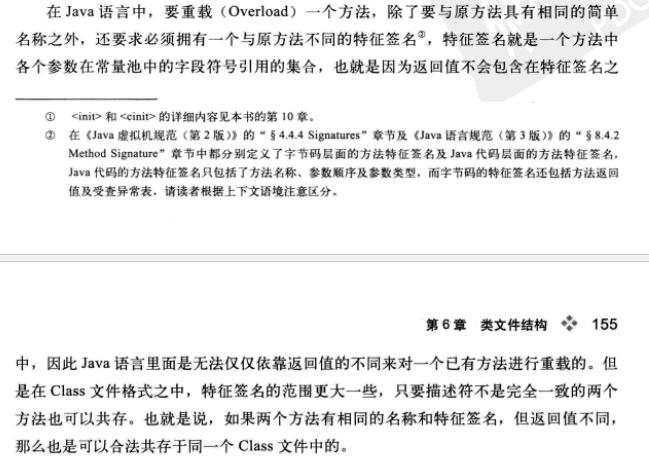

# <center>笔记</center>

### 1.java 长参数   
参数长度异常
```java
public void Stingstr(Object... varargs) {
    System.out.println(varargs.length);
}
@Test
public  void test() {
    //3个参数。长度为3
    Stingstr(1, 2, 3);
    //2个参数。长度为2
    Stingstr(1024, new String[]{"1", "2", "3"});
    //String是一个对象，所以会被拆分成一个长度为3的数组。长度为3
    Stingstr(new String[]{"1", "2", "3"});
    //int是基本类型,无法直接转换为Obj数组,所以被当成一个数组对象被obj包装(object[]{int[]})。长度为1
    Stingstr(new int[]{1, 2, 3});
    //String 数组被强转成obj对象。长度为1
    Stingstr((Object) (new String[]{"1", "2", "3"}));
}

``` 

### 2.java 重载的方法能否根据返回类型进行区分


### 3.OSGI