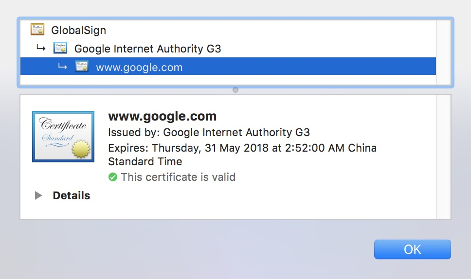

## 
网络知识
  
### 网络传输间的加密算法:  
对称加密:在加密和解密时使用相同的秘钥，或是使用两个可以简单地相互推算的密钥。 
      
非对称加密:分为公钥和私钥，公钥加密后的密文只有私钥可以解密。私钥加密后的密文公钥都可以解密。所以一般私钥存服务端，公钥存客户端。 

消息摘要:加密过程不需要密钥，并且经过加密的数据无法被解密，只有输入相同的明文数据经过相同的消息摘要算法才能得到相同的密文。     

数字签名:有公钥、私钥，还有数字签名。私钥加密生成数字签名，公钥验证数据及签名。如果数据和签名不匹配则认为验证失败。  

### Http通讯原理    
<a href="http://blog.csdn.net/a603473186/article/details/6532261" target="_blank">Http通讯原理</a>

### Https通讯原理   
<a href="https://mp.weixin.qq.com/s/C68icGtwh3IzuUbANaRXEg" target="_blank">Https通讯原理</a>

### Http和Https      
#### http  
不论是采用对称加密或者非对称加密或者其他加密算法。都会存在一通病，如何把自己的公钥或者加密算法告诉客户端，因为这个告诉的过程是明文的，中间拦截方替换其中的公钥或者加密算法。中间拦截方对服务器而言是客户端，对客户端而言是服务端。所以后续的所有通讯中间拦截方都是可以伪造的。  
#### https  
采用非对称加密和对称加密结合。https需要向CA申请证书，CA认证后颁发数字签名证书。https握手前期采用明文、中期采用非对称加密、完成之后采用对称加密。   

- 在客户端请求服务器端并附带支持的协议版本、加密方法并随机生成一个随机数。    
- 服务器端确认客户端支持的协议和加密方法，并返回数字签名证书和一个新生成的随机数。  
- 客户端验证数字证书，并重新生成一个随机数使用数字证书中的公钥加密，发送给服务端。  
- 服务端用私钥解密出第三个随机数，并根据确认好的加密方法，使用三个随机生成一个新的秘钥(对称秘钥)。后续通讯都采用新生成的秘钥加密。  

***由于证书无法伪造导致无法得到私钥，没有私钥解密不到第三个由客户端用证书中的公钥加密后的随机数，也就无法生成和客户端同样的新秘钥。***从而保证双方通讯的安全(非对称加密只能保证客户端发送给服务端数据加密，服务端发送给客户端的是没有加密的)。  

证书验证不仅检查是否在有效期内，证书是否被吊销，主要的是检查是否由上级CA签发的，上级CA证书可能还有上级，最后会找到根证书。一般系统或者浏览器会内置根证书。  
   