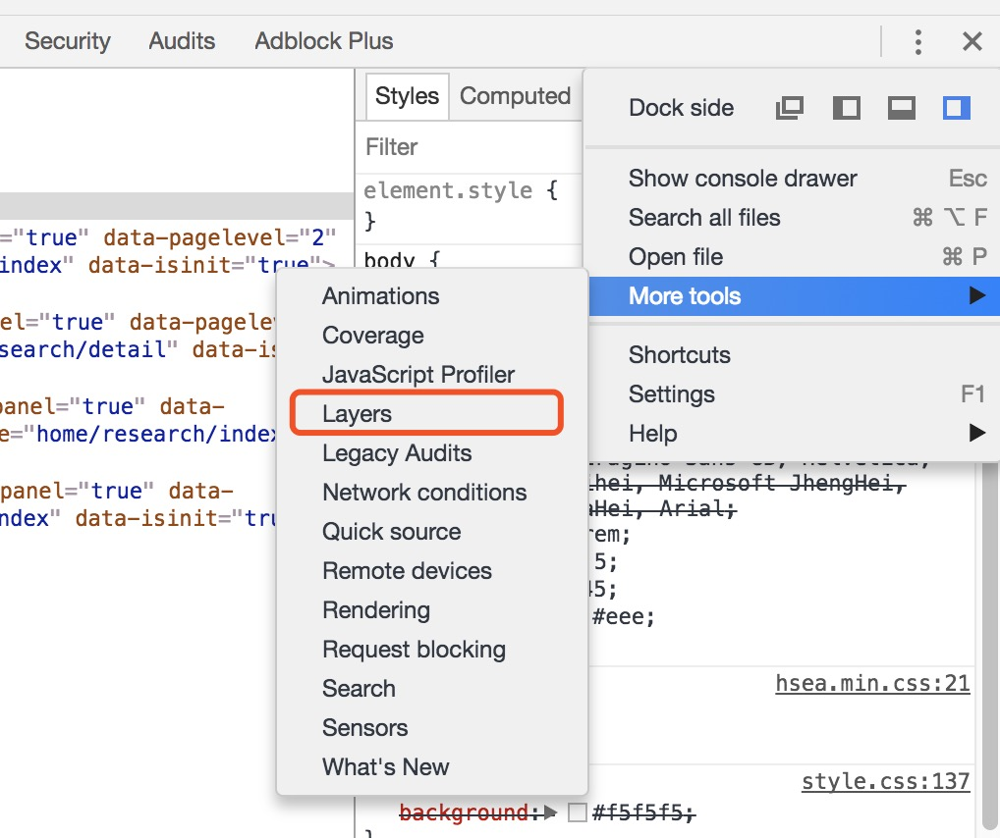
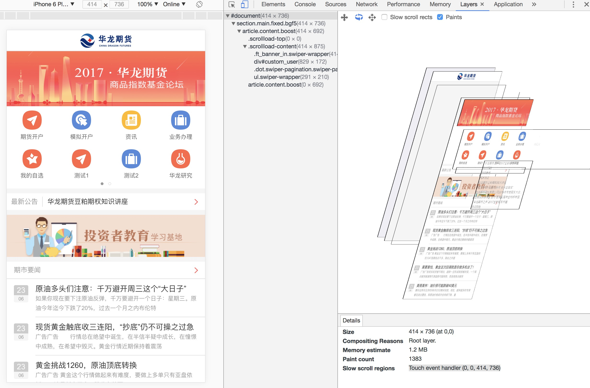
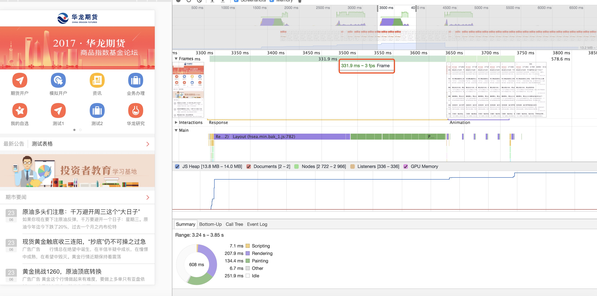
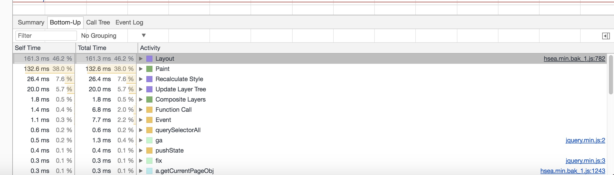
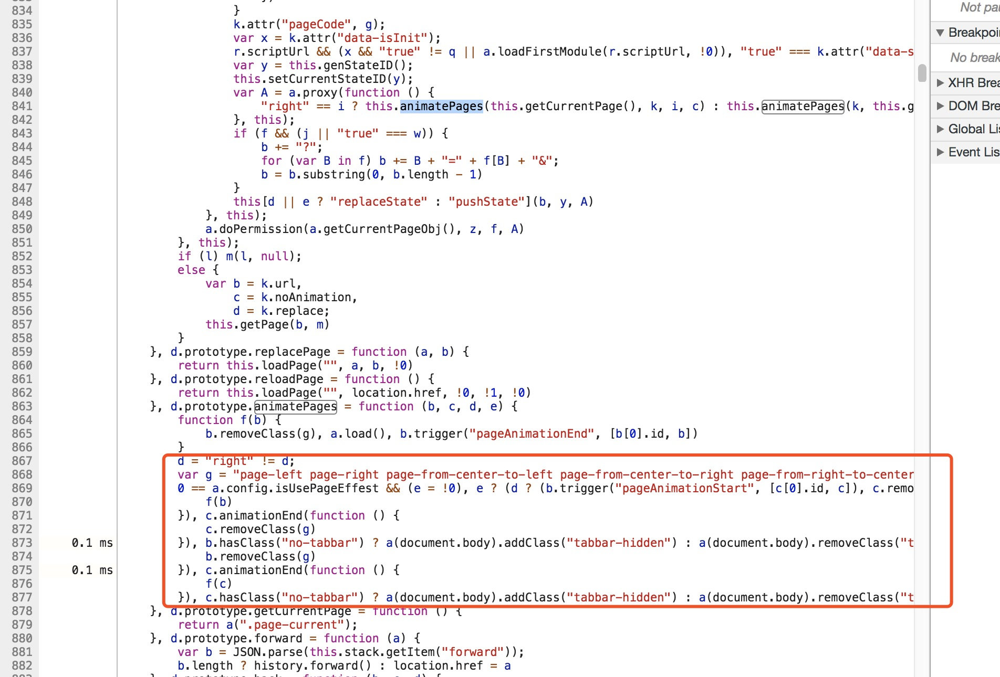

## 浏览器结构及渲染原理

- ## 1.浏览器内核

    主流浏览器渲染引擎  
        Blink(Google)、Webkit(Apple)、Gecko(Firefox)、EdgeHTML(Edge)、Trident(IE)

    Blink:对峙的产物，apple主导开发的WebKit内核，但是由于商业对峙导致谷歌新开发的内核。Blink最初是Webkit的分支渲染引擎(chrome在28版本前使用webkit内核，在28版本之后使用Blink内核)。不知道是真没更新还是假没更新，反正版本号没变，但是新东西还是在支持
    
    Webkit: (webCore,JavaScriptCore两大组件)起源KDE(组织)开发的KHTML和KJS,而后apple参与,由于对WebCore改动过多导致KDE宣布无法合并到KHTML中，进过协商apple发布webkit，并与2005年宣布开源。JS引擎使用KJS分支JavaScriptCore

    现在手机主要使用的webview浏览器内核  
    chromium(Android)、webkit(IOS)、X5(Android)(使用范围较小)

    chromium包含(Blink)开源，chrome包含chromium，但是chrome并不开源。Android 4.4之前使用webkit,之后使用chromium  
    
    webkit主要用于ios平台     
    
    X5腾讯现只用于部分腾讯产品，据说最初是起源于kpi ，fork于webkit后合并到chromium中，主要是国内android的chromium随android版本变化而变化，不统一导致效果不一致。实际上其实是加了下自己东西的某个版本的chromium

    早期js引擎是渲染引擎的一个分支，所以浏览器内核主旨渲染引擎，由于js引擎功能越来越强大，后面就独立出来了，所以现在浏览器内核代指渲染引擎+js引擎，当然浏览器不只是只有渲染引擎和js引擎，还有资源加载器、插件加载器等

    |浏览器		|渲染引擎	        |js引擎   
    |:------:     |:------:          |:------: 
    |Chrome		  |Blink			 |V8
    |FireFox	  |Gecko(Servo)	     |SpiderMonkey
    |Safari	 	  |Webkit			 |Nitro
    |Edge		  |EdgeHTML		     |Chakra
    |IE			  |Trident			 |Chakra

    谷歌历史版本更新记录:   
    [https://en.wikipedia.org/wiki/Google_Chrome_version_history](https://en.wikipedia.org/wiki/Google_Chrome_version_history)  
    火狐历史版本更新记录:   
    [https://en.wikipedia.org/wiki/Firefox_version_history](https://en.wikipedia.org/wiki/Firefox_version_history)   
    safar历史版本更新记录:   
    [https://en.wikipedia.org/wiki/Safari_version_history ](https://en.wikipedia.org/wiki/Safari_version_history ) 

- ## 2.渲染引擎 
    
    

    DOM：Document Object Model，浏览器将HTML解析成树形的数据结构，简称DOM。
    
    CSSOM：CSS Object Model，浏览器将CSS代码解析成树形的数据结构.
    
    Render Tree：DOM 和 CSSOM 合并后生成 Render Tree(Render Tree 和DOM一样，以多叉树的形式保存了每个节点的css属性、节点本身属性、以及节点的孩子节点，display:none 的节点不会被加入 Render Tree，而 visibility: hidden 则会，所以，如果某个节点最开始是不显示的，设为 display:none 是更优的。)

    为什么渲染流程的最后一步是display:
    Rendering tree 渲染树并不等同于DOM，因为前面说到的被display:none的不会加入渲染树，所以最后一步是渲染后的加上隐藏的和header部分才是一个完整的dom

    大概三种渲染模式(怪异模式(HTML3)、有限怪异模式(HTML4)、标准模式)

    呈现六部：  
    1.构建DOM树   
    2.构建CSSOM树   
    3.合并DOM树和CSSOM树成Render树  
    4.计算布局Layout  
    5.绘制Paint  
    6.合成Composite  

    Composite复合层主要是由硬件加速分割出来的多个显示层，  
    分割多个显示层主要是提升性能和流畅度。同样过多的复合图层，同样会造成页面卡顿。详情可以收索硬件加速的坑。  
    主要触发硬件加速的属性。  
    transform  
    opacity  
    filter  
    will-change  

    主要影响页面性能的二大因素  
    1.回流（Reflow）是指布局引擎为frame计算图形的过程  
    2.重绘（Repaint）发生在元素的可见性发生变化时，比如背景色、前景色等。 因此回流必然会引起重绘。  

    回流必定导致重绘，重绘不一定会引起回流。  
    在性能优先的前提下，性能消耗 reflow大于repaint  
    repaint是某个DOM元素进行重绘；reflow是整个页面进行重排，也就是页面所有DOM元素渲染，通常是导致页面卡顿的主要因素。  
    
    引起回流主要因素:  
    1.窗口大小调整  
    2.字体大小调整  
    3.样式变动  
    4.元素内容变动  
    5.CSS伪类激活  
    6.DOM增删改操作  
    7.获取某些属性  
    很多浏览器会对回流做优化，他会等到足够数量的变化发生，在做一次批处理回流。 但是除了render树的直接变化。 当获取一些属性时，浏览器为了获得正确的值也会触发回流。这样就使得浏览器的优化失效了  

    如何避免回流  
    1.避免逐项更改样式。最好一次性更改style属性，或者将样式列表定义为class并一次性更改class属性  
    2.避免循环操作DOM。创建一个documentFragment或div，在它上面应用所有DOM操作，最后再把它添加到window.document  
    3.避免循环读取offsetLeft等属性。在循环之前把它们存起来。  
    4.绝对定位具有复杂动画的元素。绝对定位使它脱离文档流，否则会引起父元素及后续元素大量的回流  
                    
- ## 3.谷歌浏览器

    

    1.浏览器是多进程的。  

    2.谷歌浏览器创建那些进程   
     浏览器进程(1个)     **用于管理标签页、窗口和浏览器本身。这个进程同时负责处理所有跟磁盘、网络、用户输入和显示的交互**
     GPU(1个)   
     渲染器进程(多个)  
     插件进程(多个)  
    具体有哪些可以通过谷歌右上角设置>More Tools>Task Manager查看  

    3.chromium源码 (有兴趣可以看下)  
        源码地址：  
        [https://chromium.googlesource.com/chromium/src](https://chromium.googlesource.com/chromium/src)  
        简单解析源码地址:  
        [https://zhuanlan.zhihu.com/p/24911872?refer=dreawer](https://zhuanlan.zhihu.com/p/24911872?refer=dreawer)  

- ## 4.Chrome DevTools常用模块

    对于性能调优不是很了解的建议点击下面的链接，初步了解下:

    Chrome DevTools 之 Network，网络加载分析利器:  
    [http://www.jianshu.com/p/471950517b07](http://www.jianshu.com/p/471950517b07)   

    Chrome DevTools 之 Timeline，快捷性能优化工具：  
    [http://www.jianshu.com/p/b8cdcd9bfad8](http://www.jianshu.com/p/b8cdcd9bfad8)  

    Chrome DevTools 之 Profiles，深度性能优化必备：  
    [http://www.jianshu.com/p/504bde348956](http://www.jianshu.com/p/504bde348956)  

    **Note:**   
        **在 Chrome 57 之后Timeline面板更名为Performance面板.**  
        **在 Chrome 57 之后Profiles面板更名为Memory面板.**    
        **在 Chrome 57 之后Resources面板更名为Application面板.**    

    了解页面整体层次结构需要用到Layers面板。
    在DevTools中点击右上角的管理按钮>More Tools>Layers
     
     

- ## 5.简单示例

    大面积回流导致页面卡顿
      
    从上图可以看到从首页进入资讯页出现卡顿，而从资讯回到首页没有出现卡顿。   
    从图中的Layers面板中可以看出资讯页面列表过多，进行大面积的样式操作的时候,大量的计算需要消耗cpu的计算可能是导致卡顿的主要原因。   
      
    从上图可以看出整个页面切换的前中期fps只有3,进行大面积的dom 最下面的饼状图可以清楚的看到整个呈现(Rendering)和绘制(Painting)占用了大部分的时间。  
    把底部切换到Bottom-Up面板  
     
    从这里可以看到是hseaJS的782行这里消耗了大量的时间。  
       
    查看代码发现hseajs的782行这个函数里面唯一进行类似页面切换操作的是animatePages函数。从animatePages函数可以看到，这个切换操作其实就是CSS进行动画效果的切换。  

    在hseajs和切换效果不能修改的前提下，我们只能修改自身代码，来解决切换卡顿的问题。  
    在前面说到,大面积的样式操作的时候，需要消耗cpu计算。那为什么从资讯切换到首页不卡顿呢。**从示例的第一张图可以看出从首页切换到资讯时候，是资讯页面滑动覆盖首页。从资讯页面切回到首页是首页滑动覆盖资讯页面。首页切换到资讯页面卡顿，而资讯切换到首页不卡顿，说明只要不进行大面积的样式操作就不会卡顿，那么只要把资讯页面缩小到首页大小就可以解决卡顿问题。**
    根据渲染原理，display的节点不会进行计算，那么只要在切换前把资讯页面没有显示的其他列表display掉。切换到资讯页面后再显示就行了。
    
     

        
        